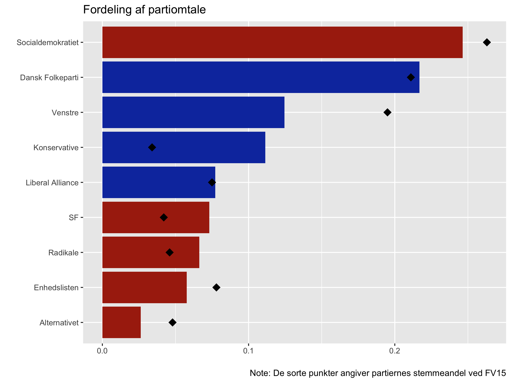
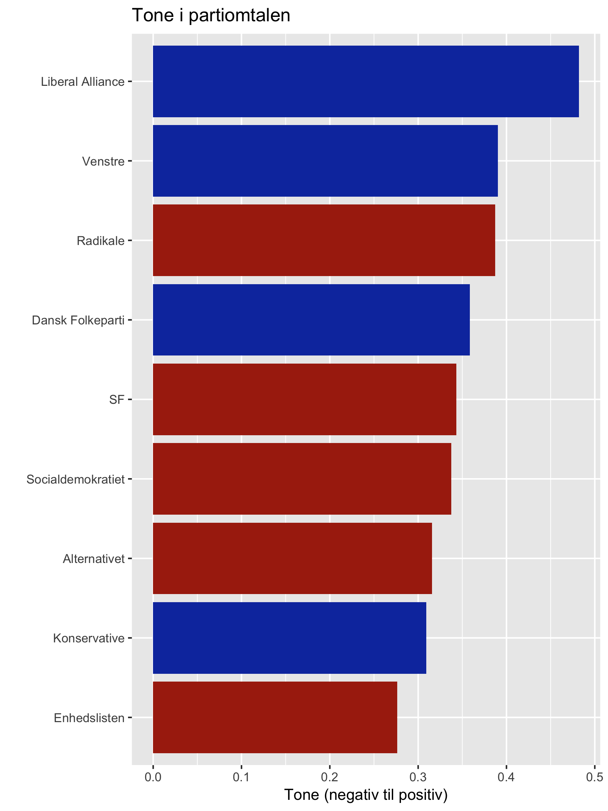
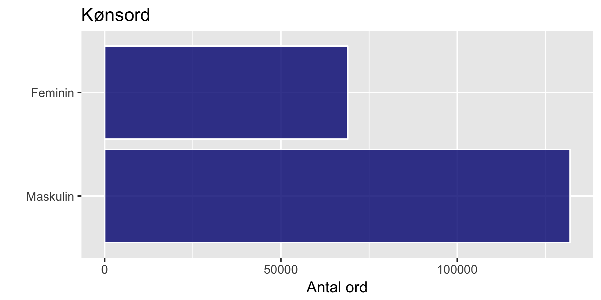
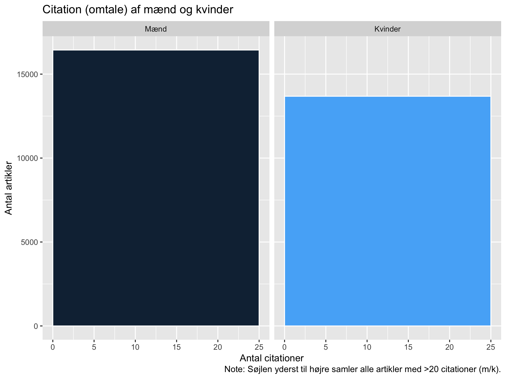
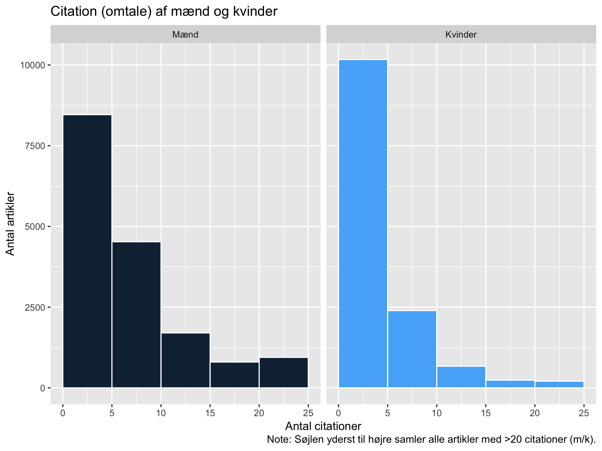
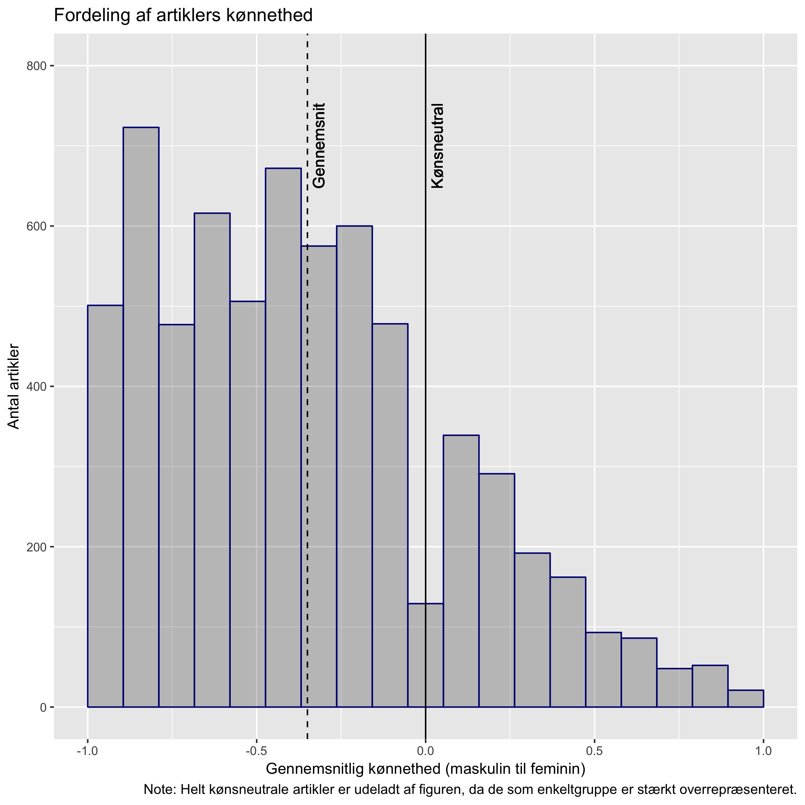
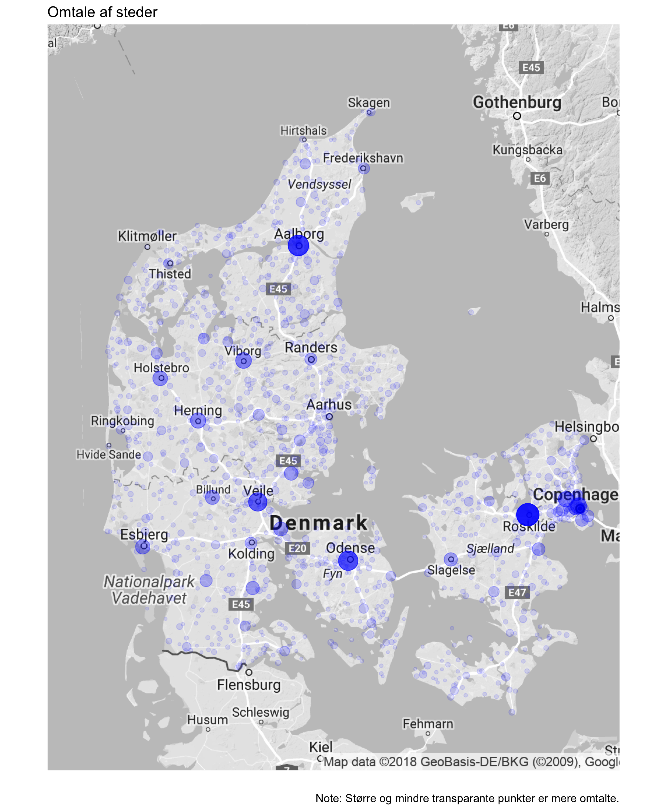
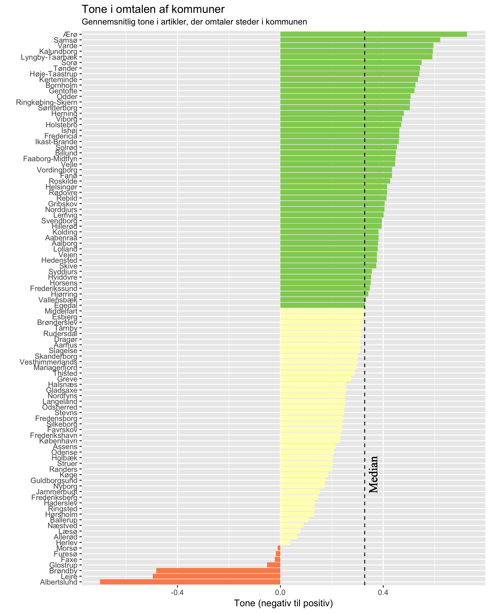
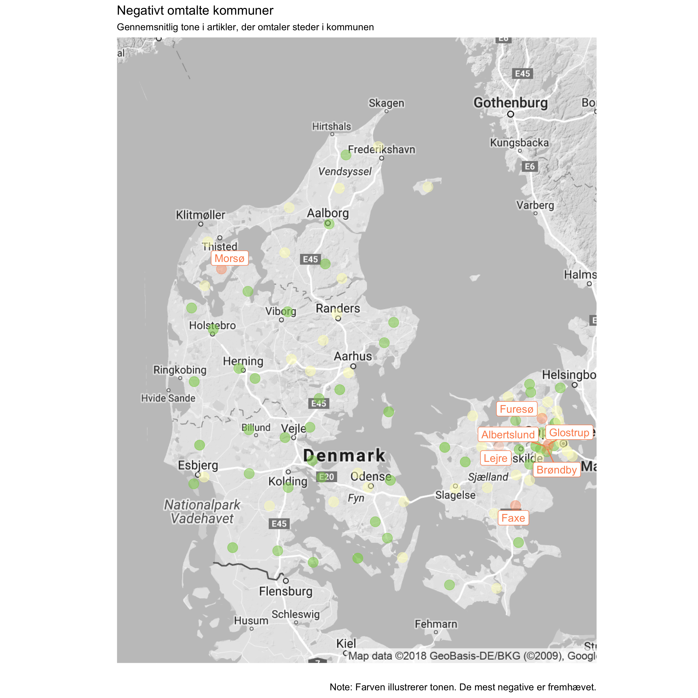
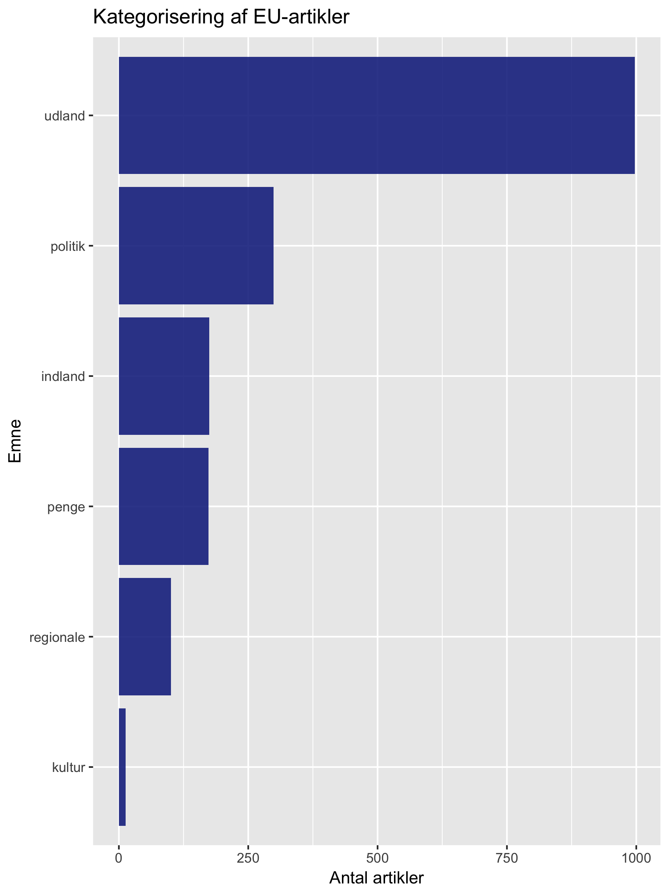

```{r xaringan-themer, include = FALSE}
library(xaringanthemer)
mono_accent(
  base_color = "#23395b",
  header_font_google = google_font("Josefin Sans"),
  text_font_google   = google_font("Montserrat", "300", "300i"),
  code_font_google   = google_font("Droid Mono")
)
```

# Formål 

* *I hvilket omfang er DRs online nyhedsdækning i overensstemmelse med public servicemålsætningerne og i øvrigt unbiased?*
* Bias = skævheder eller ubalancer
* Udgangspunkt i public service-begrebet - lever DR op til forpligtelserne?
* Eksplorativ undersøgelse
* Idéen er at 'udlede' nogle kritiske analysedimensioner fra public service, som har politisk relevans:
   1. **Partier**
   2. **Køn**
   3. **Geografi**
   4. Immigration
   5. EU

---

# Public service

* *Der skal i udbuddet tilstræbes kvalitet, alsidighed og mangfoldighed*
* *Ved informationsformidlingen skal der lægges vægt på saglighed og upartiskhed*
* *At samle og spejle Danmark. DR skal samle danskerne i store og små fællesskaber*
* *DR skal tilbyde en bred samfundsmæssig dækning og afspejle mangfoldigheden af kultur, livsopfattelse og levevilkår*
* *DR skal medvirke til at fremme integration i det danske samfund.*
* *DR skal styrke danskernes viden om og forståelse for internationale forhold, herunder særligt europæiske forhold, samt andre kulturer og synspunkter. DRs programmer må ikke på nogen måde tilskynde til had på grund af race, køn, religion, nationalitet eller seksuel observans.*

---

# Teori: Medieeffekter

* Idéen om at omtale af emner og problemstillinger i det hele taget, bestemte vinkler, bestemt sprogbrug, etc. påvirker folk på en måde, der kan have politiske konsekvenser 
* Kaldes også agenda-setting (medierne sætter dagsordenen for folks politiske diskussioner og tanker)
* Begrænsede effekter og tvetydige resultater -- men typisk målt som kortsigtede, direkte effekter
* Stadigvæk lang vej for vores viden om medieeffekter 
* At medierne påvirker folk antages ofte i den offentlige debat som grundlag for kritik af medierne -- antages derfor også her 

---

# Metode

* Data science med politologisk perspektiv
* "*Language is the medium for politics*"
* Kvantitativ tekstanalyse
* *Bag of words*-antagelsen
* Sentimentanalyse: *Tonen* i artiklerne
* Data: **17.520 artikler** fra dr.dk/nyheder (16 per dag) i hele perioden 2015-2017
* Brydes op i **3,8 mio. ord**, som hver får en sentiment-score (positiv, negativ, neutral). Sentiment-scorene kommer fra en "ordbog" fra DTU.
* Scorene opsummeres til en gennemsnitlig *tone* for hver artikel
* Primært grafiske analyser (plots m. ggplot2 i R)
* Flere detaljer under de enkelte analysedimensioner


---
layout: false
class: inverse, middle, center

# Resultater

---

# Politiske partier

* *Er der en skæv fordeling i omtalen af de politiske partier og i anvendelsen af positivt/negativt ladede ord i forbindelse med hvert enkelt parti?*
* Markeres hver gang en artikel nævner et politisk parti
* Fokus på **hyppighed af omtale** og **gennemsnitlig tone**, når partiet omtales
* Antagelse: Omtalen af partierne bør svare til deres stemmetal (andelen af danskere, de 'repræsenterer')

---

# Politiske partier

```{r, echo = F, out.width="100%"}

```

---

```{r, echo = F, out.width="65%"}

```


---

# Køn

* *Er der færre feminint kønnede artikler, end maskulint kønnede, og anvender de mere negativt ladede ord?*
* Artiklernes "kønnethed”:
    1. Personnavne: Ankestyrelsens lister over godkendte drenge- og pigenavne 
    2. Navne- og stedord, bl.a. ”ham”, ”hende”, ”han”, ”hun”, ”hans”, ”hendes”, ”mand”, ”kvinde”. 
* Feminine navne og ord = 1, maskuline navne og ord = -1
* Hver artikel får en score mellem -1 og 1, der viser dens gennemsnitlige kønnethed 

---

# Køn

```{r, echo = F, out.width="100%"}

```

---

# Køn

```{r, echo = F, out.width="100%"}

```

---

# Køn

```{r, echo = F, out.width="100%"}

```

---

```{r, echo = F, out.width="75%"}

```

---

# Geografi

* *Omtales udkantsområder af Danmark eller bestemte kommuner relativt mindre, og anvendes der mere negativt ladede ord for udkantsområderne eller bestemte kommuner?*
* Geodata kobles til tekstdata for at kunne identificere omtale af (op til) 15.035 danske by- og stednavne. Ord, der matcher et sted, får et geografisk koordinat. Kommunenavnet tilføjes til hvert sted.
* **Hyppighed af omtale** af forskellige steder i forskellige kommuner
* Antagelse: Kommuner bør omtales svarende til deres indbyggertal (andelen af danskere, de 'repræsenterer')
* **Gennemsnitlig tone** i artikler, der omtaler (steder i) kommunerne 


---

# Geografi

.pull-left[
```{r, echo = F, out.width="120%"}

```
]
---

# Geografi

.pull-left[
```{r, echo = F, out.width="100%"}
knitr::include_graphics("Plots/GEO - Overrepræsenterede kommuner.png")
```
]

.pull-right[
```{r, echo = F, out.width="100%"}
knitr::include_graphics("Plots/GEO - Underrepræsenterede kommuner.png")
```
]

---

```{r, echo = F, out.width="65%"}

```

---

# Geografi

```{r, echo = F, out.width="65%"}

```


---

# Immigration

* *Anvendes der i artikler om immigration (flygtninge, indvandring mv.) en særligt positiv eller negativ tone?*
* Hvor meget fylder immigration i hver artikel (antal ord)?
* Statistisk korrelation mellem hvor meget artiklerne omtaler immigration og deres tone? 
* Indikerer **om artikler, der omtaler immigration, er mere negative** end andre 

---

# Immigration

.pull-left[
```{r, echo = F, out.width="100%"}
knitr::include_graphics("Plots/IMMIGRATION - Sammenhæng mellem tone og immigration.png")
```
]

.pull-right[
```{r, echo = F, out.width="100%"}
knitr::include_graphics("Plots/IMMIGRATION - Sammenhæng mellem tone og immigration over tid.png")
```
]

---

# EU 

* *Anvendes der i artikler om EU en særligt positiv eller negativ tone, og hvordan kategoriseres artiklerne?*
* Hvor meget fylder EU i hver artikel (antal ord)?
* Statistisk korrelation mellem hvor meget artiklerne omtaler EU og deres tone? 
* Indikerer **om artikler, der omtaler EU, er mere negative** end andre 

---

# EU 

.pull-left[
```{r, echo = F, out.width="100%"}
knitr::include_graphics("Plots/EU - Sammenhæng mellem tone og EU.png")
```
]

.pull-right[
```{r, echo = F, out.width="100%"}

```
]

---

# Konklusion

* Man kan godt tale om en negativ bias ift. **politiske partier, køn og geografi**
* Men det afhænger i sidste ende af ens normative standarder.
* ... og det afhænger af ens antagelser: 
    * F.eks. antager analysen af fordelingen af omtale mellem partier og mellem kommuner, at der sker lige mange ting hvert sted, som DR potentielt kunne gøre til en nyhed  
    * og analysen af citationsbias (køn) antager, at der er lige mange mænd og kvinder, som man kunne have citeret.  

---

# Hvad kan man undersøge videre?

*	Gå 'videre' med dimensioner, DR ønsker at prioritere. 
    * Find flere interessante sammenhænge i de eksisterende dimensioner, fx gå mere ind i omtale af politiske partier over tid
    * Gå mere i dybden og lav flere tjek af resultaternes robusthed, f.eks. af sentiment-scorerne. 
    * Find eksempler på artikler, der kan være problematiske (trækker tallene i en bestemt retning) 
*	Tilføj nye dimensioner - data er der
*	Lav analyse på 2018 (og evt. 2019) - data er der. For at have resultater, der er up-to-date og/eller for at se, om der er sket en udvikling over årene.

<!---
Eksporter til PDF:

--->
