```{r}
#| include: false
pacman::p_load(tidyverse, janitor, patchwork, kableExtra, knitr)
options(scipen=999)
Sys.setlocale("LC_TIME", "da_DK") # sæt sproget til dansk (dato-labels)
```

## Kontekst: atomkraft og klima

:::: {.columns}
::: {.column width="50%"}

<br>

- **52 %** af danskerne er *bekymrede* over klimaforandringernes konsekvenser<br>(*Megafon 2025*)
    - 60 % i 2022
- **Klima** oversteg alle andre emner ved både FV19 og FV22\*
    - ca. 50 % nævnte *klima* som et af de vigtigste emner 
- **Atomkraft** er i 2025 en del af *klimadebatten*

:::
::: {.column width="5%"}
:::
::: {.column width="45%"}
```{r}
#| out-width: 75%
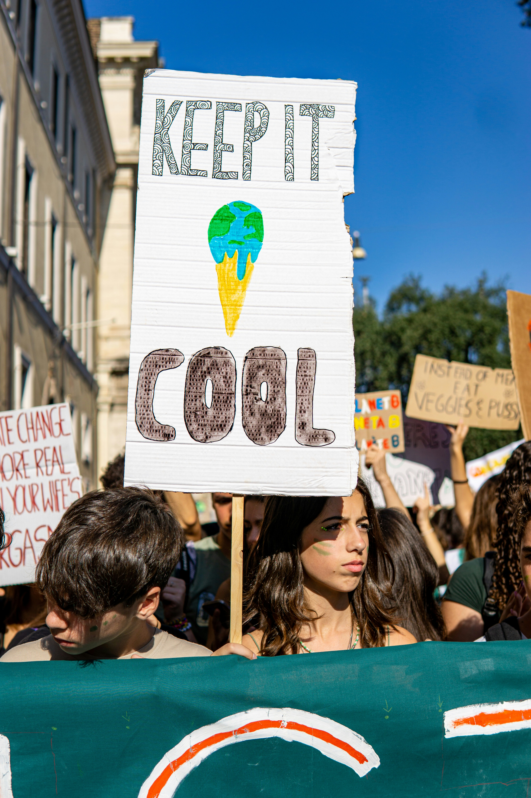
```

:::
::::

## Opbakning til atomkraft

> Det bliver nødvendigt at indføre atomkraft, hvis Danmark skal klare fremtidens energibehov

:::: {.columns}
::: {.column width="49%"}

- Hvad betyder det at *'indføre'* atomkraft?
- Hvor stort er *'fremtidens energibehov'*? Hvornår?
- Hvor *effektivt* er atomkraft vs. alternativer
- Hvor godt kan man *lide* atomkraft vs. alternativer
- **&rarr; Opbakning til atomkraft:**
    - *helt/delvist enig (%)*

:::
::: {.column width="2%"}
:::
::: {.column width="49%"}
```{r}
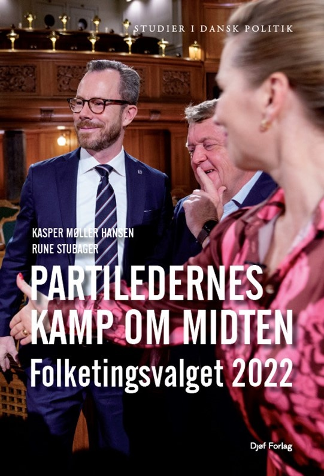
```
*Valgundersøgelsen 2022*
:::
::::

## Opbakning til atomkraft i 1981 &rarr; 2022

> Det bliver nødvendigt at indføre atomkraft, hvis Danmark skal klare fremtidens energibehov

:::: {.columns}
::: {.column width="49%"}

- Ca. **80 %** har en holdning til atomkraft (ca. 20 % ved ikke)
    - fokus på **de 80 % &darr;**
- **Helt/delvist enig** (*opbakning*):
    - 31 % (1981) &rarr; **44 % (2022)**
    - *højrefløjen:* 43 % &rarr; **57 %**
    - *venstrefløjen:* 21 % &rarr; **33 %**
    
:::
::: {.column width="2%"}
:::
::: {.column width="49%"}
```{r}
include_graphics("https://www.atomkraft-jatak.dk/wp-content/uploads/2020/08/Facebook-thumbnail.png")
```

:::
::::


## Opbakning til atomkraft i 1981 &rarr; 2022

> Det bliver nødvendigt at indføre atomkraft, hvis Danmark skal klare fremtidens energibehov

:::: {.columns}
::: {.column width="58%"}

- __*Helt* uenig__ (*modstand*):
    - 48 % (1981) &rarr; **24 % (2022)**
    - *højrefløjen:* 34 % &rarr; **14 %**
    - *venstrefløjen:* 60 % &rarr; **33 %** 
    
- **Atomkraft** hverken konsensus- eller flertalsemne
    - 44 % opbakning (36 % af danskerne)
- Men et politisk **tabu** er brudt!
    - markant holdningsskift

:::
::: {.column width="2%"}
:::
::: {.column width="40%"}

```{r}
#| out-width: 65%
include_graphics("https://noah.dk/sites/default/files/styles/skaler_960px_bred/public/2017-02/Atomkraft%20nej%20tak.png?itok=hx8-tZj7")
```

:::
::::
    
## Opbakning til atomkraft i 2023

> Mener du, at man skal undersøge muligheden for at udvikle A-kraft som energikilde i Danmark? (*Epinion 2023*)

. . .

::: {.nonincremental}

- **Ja:** 55 %
- **Nej:** 26 %
- Ved ikke: 19 %

:::
 
## Opbakning til atomkraft i fem generationer

> Det bliver nødvendigt at indføre atomkraft, hvis Danmark skal klare fremtidens energibehov

::: {.nonincremental}

- **Fem generationer** pba. *fødselsår*:

:::

. . .

```{r}
tribble(~Generation, ~Fødselsår, ~`Alder FV81`, ~`Alder FV22`, 
        "Mellemkrigsgenerationen", "1918-1945", "36-63 år", "77-104 år",
        "68'er generationen", "1946-1959", "22-35 år", "63-76 år",
        "Generation X", "1960-1974", "18-21 år", "48-62 år",
        "Millennials", "1975-1990", "", "32-47 år", 
        "Generation Z", "1991-2004", "", "18-31 år") |> 
  kable(align = c("l","c","r", "r"))
```

- **Ideologi:** selvplacering på venstre-højre-skala (0-10)
    - 0-4: *venstreorienteret*, 6-10: *højreorienteret*

## Opbakning til atomkraft i fem generationer

```{r}
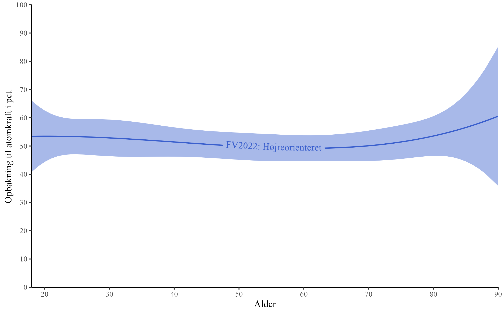
```

## Opbakning til atomkraft i fem generationer

```{r}
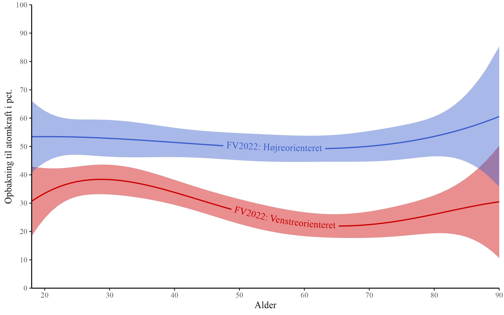
```

## Opbakning til atomkraft i fem generationer

```{r}
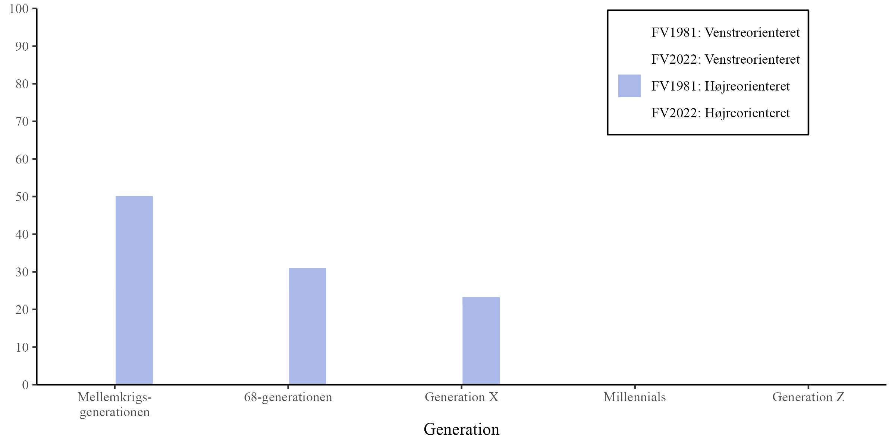
```

## Opbakning til atomkraft i fem generationer

```{r}
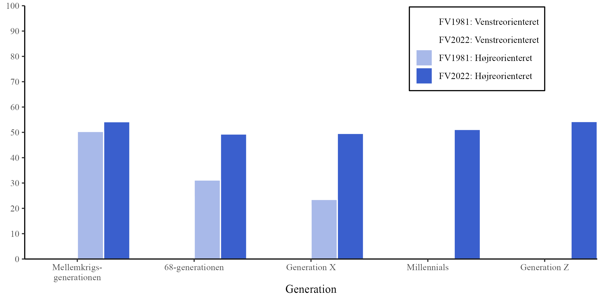
```

## Opbakning til atomkraft i fem generationer

```{r}
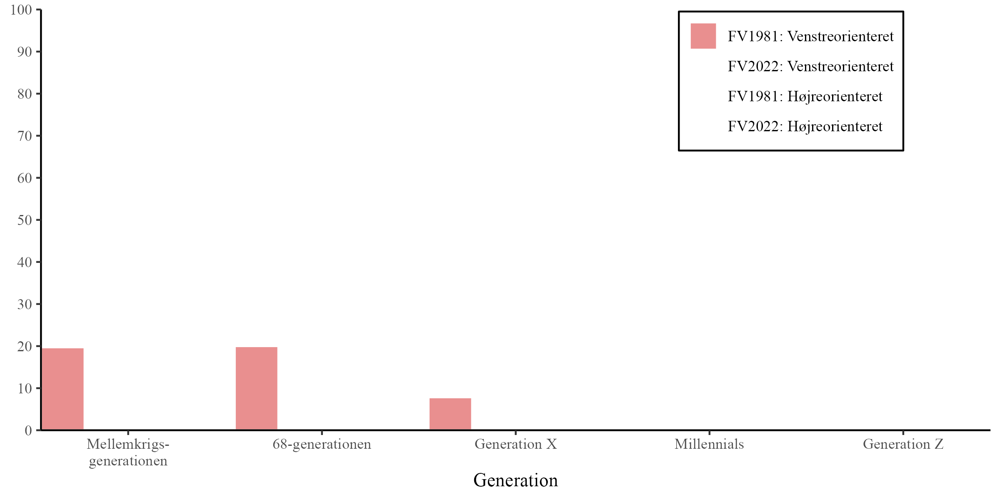
```

## Opbakning til atomkraft i fem generationer

```{r}
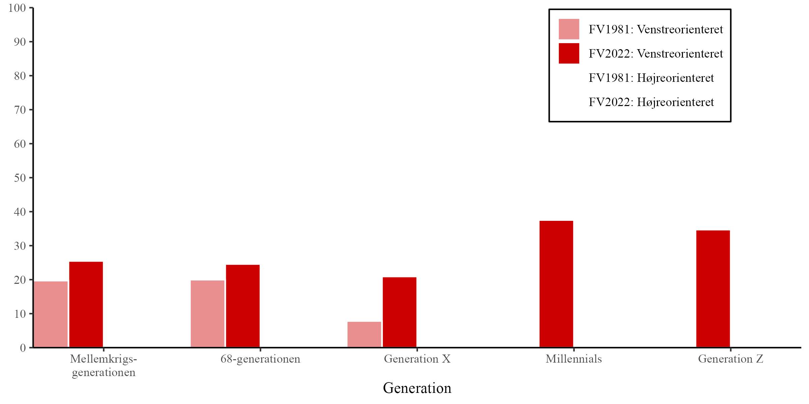
```

## Opbakning til atomkraft i fem generationer

```{r}
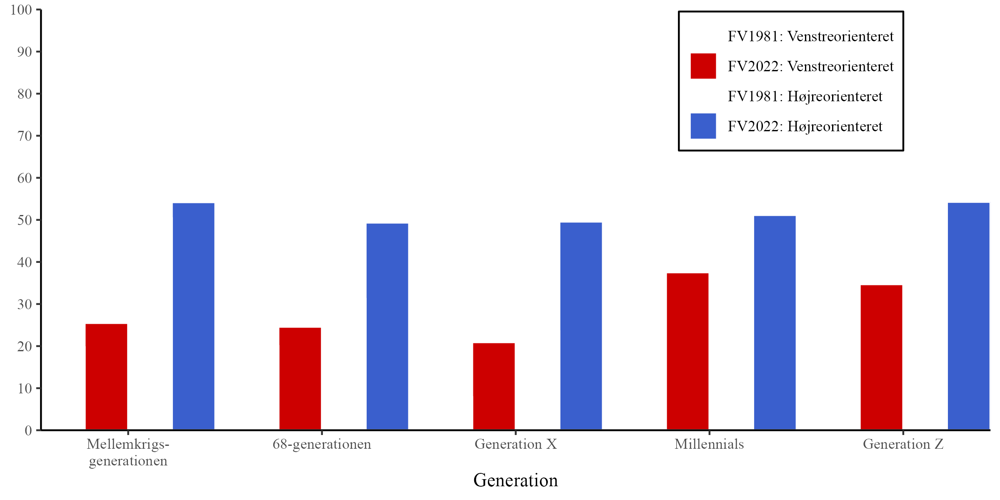
```

<!-- ## Skillelinjer -->

<!-- ::: {.nonincremental} -->

<!-- 1. Ideologi og partier -->
<!-- 2. Køn -->
<!-- 2. **Klimaholdninger:** -->
<!--     - *teknooptimisme* -->
<!--     - *offervillighed* -->

<!-- ::: -->

## Opbakning til atomkraft og klimaholdninger

```{r}
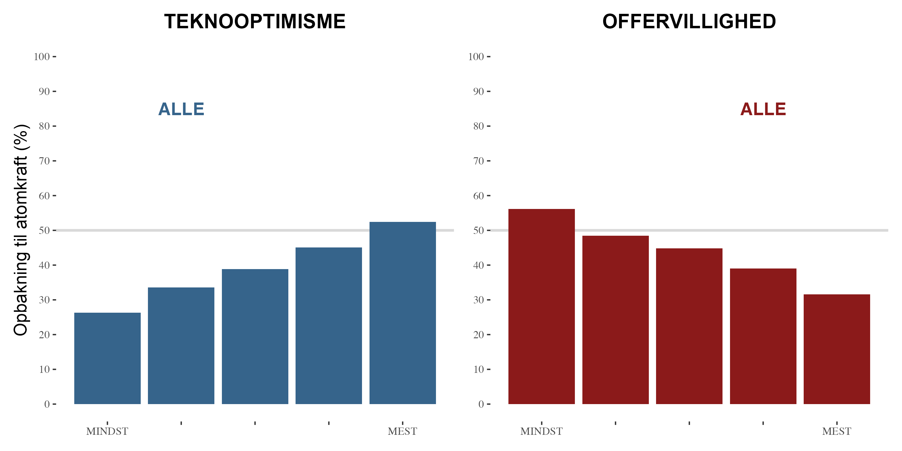
```

::: {.notes}

`m <- feols(cc_nuclear2 ~ cc_standard + cc_newtech + age + i(gender) + i(education) + i(pers_income), data = datanal, weights = datanal$weight)`

:::

## Opbakning til atomkraft og klimaholdninger

```{r}

```

::: {.nonincremental}

- MINDST teknooptimistisk & MEST offervillig: **21 %**
- MEST teknooptimistisk & MINDST offervillig: **66 %**

:::

::: {.notes}

`m <- feols(cc_nuclear2 ~ cc_standard + cc_newtech + age + i(gender) + i(education) + i(pers_income), data = datanal, weights = datanal$weight)` 

:::

## Opbakning til atomkraft og køn

```{r}
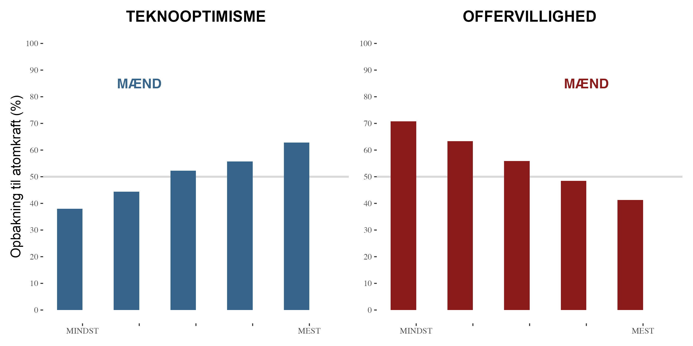
```

::: {.notes}

`m <- feols(cc_nuclear2 ~ gender * cc_standard + gender * cc_newtech + age + gender + i(education) + i(pers_income), data = filter(datanal, gender %in% 1:2), weights = datanal[datanal$gender %in% 1:2, "weight"]$weight)`

:::

## Opbakning til atomkraft og køn

```{r}
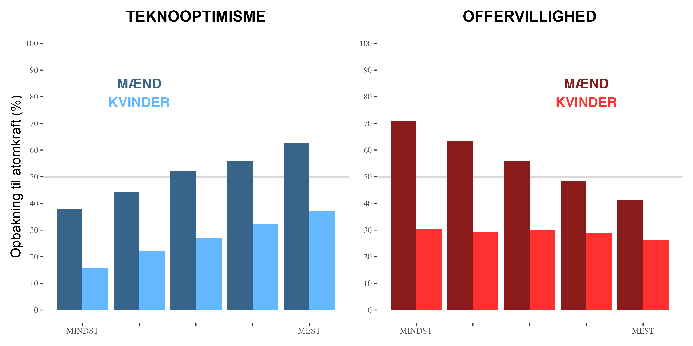
```

::: {.notes}

`m <- feols(cc_nuclear2 ~ gender * cc_standard + gender * cc_newtech + age + gender + i(education) + i(pers_income), data = filter(datanal, gender %in% 1:2), weights = datanal[datanal$gender %in% 1:2, "weight"]$weight)`

:::

## Opbakning til atomkraft og køn

```{r}

```

::: {.nonincremental}

- MINDST teknooptimistisk & MEST offervillig *KVINDE*: **16 %**
- MEST teknooptimistisk & MINDST offervillig *MAND*: **76 %**

:::

::: {.notes}

`m <- feols(cc_nuclear2 ~ gender * cc_standard + gender * cc_newtech + age + gender + i(education) + i(pers_income), data = filter(datanal, gender %in% 1:2), weights = datanal[datanal$gender %in% 1:2, "weight"]$weight)`

:::

## Hvad former vores holdninger til atomkraft?

1. **Socialisering**
    - atomkraftulykker, aktivisme
    - fokusbegivenheder
2. **Grundlæggende psykologiske træk**
    - risikovillighed
3. **Ideologi**
4. **Partipolitiske signaler**
    - mainstreaming
5. **Teknologisk udvikling**

## Konklusion {background-color="#026B81"}

:::: {.columns}
::: {.column width="49%"}

- Et **tabu** er brudt
    - *opbakning*: 31 % &rarr; **44 %**
    - *modstand*: 48 % &rarr; **24 %**
- Men markante **skillelinjer**
    - befolkningsgrupper
    - ideologi og klimapolitiske holdninger
    - potentielt polariserende emne
- Samlet set tegn på **stigende opbakning**<br>til (at undersøge mulighederne for) **atomkraft**

:::
::: {.column width="5%"}
:::
::: {.column width="45%"}

```{r}
#| out-width: 65%
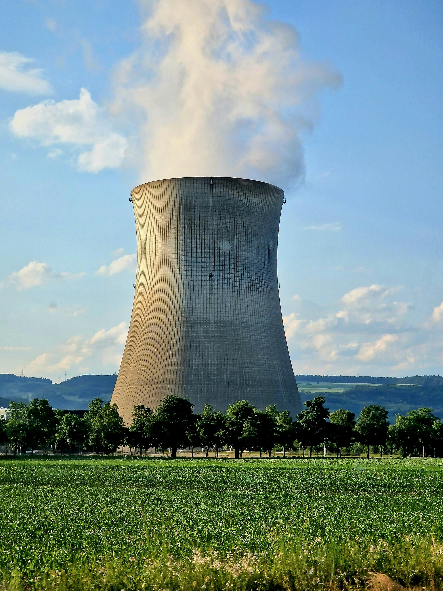
```

:::
::::


. . .

<br>

### Tak for opmærksomheden! {background-color="#026B81"}