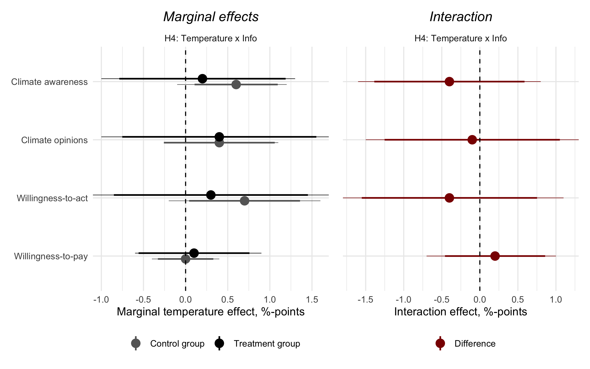

```{r, include = FALSE}
pacman::p_load(tidyverse, 
               knitr, 
               lubridate, 
               kableExtra,
               xaringan,
               xaringanExtra)

knitr::opts_chunk$set(echo = FALSE, 
                      fig.align = "center", 
                      cache = TRUE,
                      out.width="1000px"
)

Sys.setlocale(locale = "da_DK.UTF-8")

xaringanExtra::use_tile_view()
xaringanExtra::use_panelset()
```

```{r xaringan-themer, include=FALSE, warning=FALSE}
library(xaringanthemer)

style_mono_accent(
  # Colors
  base_color = "#8b2325",
  text_color = "#000000", 
  link_color = "#808080", 
  text_bold_color = "#8b2325",
  title_slide_background_color = "#8b2325",
  title_slide_text_color = "#FFFFFF",
  colors = c("white" = "#FFFFFF", "black" = "#000000", "grey" = "#808080", "kingblue" = "#0D0668", "lightgrey" = "#CDCEC6"),
  # Fonts
  text_bold_font_weight = "normal",
  text_font_base = "sans-serif",
  text_font_google = google_font("Metrophobic"),
  code_font_google = google_font("Metrophobic"),
  header_font_google = google_font("Metrophobic"),
  base_font_size = "16pt",
  text_font_size = "16pt",
  code_font_size = "16pt",
  code_inline_font_size = "16pt",
  header_h1_font_size = "30pt",
  header_h2_font_size = "20pt",
  header_h3_font_size = "20pt")

# Ekstra
style_extra_css(
  css = list(
    ".left-column" = list("width" = "33%",
                          "height" = "95%",
                          "float" = "left"),
    ".right-column" = list("width" = "65%",
                           "height" = "95%",
                           #"padding-left" = "1em",
                           "float" = "right")))
```

background-image: url(media/bodil.png)
background-size: cover

.right[.grey[Image by Jeanne and John Bollerup-Jensen]]
---
background-image: url(media/lyngbyvej.jpg)
background-size: cover

.right[.grey[Image by Bente Schou]]
---
background-image: url(media/wildfire2.png)
background-size: cover

.right[.grey[Image by AFP via Getty Images]]
---
background-image: url(media/beachheat.jpg)
background-size: cover

.right[.grey[Image by Erik Refner / Scanpix Denmark]]
---

.right[.grey[Screenshot of https://bit.ly/3FPusXn]]
```{r, out.width="80%"}

```


---

.right[.grey[Screenshot of https://cnn.it/3L5I1ml]]
```{r, out.width="80%"}

```


---
class: middle
background-color: lightgrey

# RQ:

## How do personal climate change experiences affect political opinions and behavior towards climate change &mdash; and how is this relationship moderated by media narratives about climate change?

---
class: middle

# Overview

1. PhD project outline

2. .grey[The Local Warming Effect]

3. .grey[Follow-up study on interaction between experience and mediated information]

4. .grey[Conclusion]

5. .grey[Other work]

---

# PhD project outline

- As the global climate warms, we will all encounter weather events that are, or could be, "caused by" climate change

    - heatwaves, drought, floods, cloudburst, storm surge

--

- **Personal weather experiences** contain information that may be relevant for climate attitudes and behavior
    - &rarr; political effects of weather events

--

- The canonical source of **political information** &mdash; and key driver of opinion formation &mdash; is the (mass) **media and elite discourse**

--

- But **personal experience with climate change** may be important, e.g., because the issue is so **abstract**

--

## What if the two "information sources" interact?

--

- Weather experiences are not always interpreted as related to climate change

--

- **The media** may make the climate-weather link salient (and increasingly do), which **activates or politicizes weather experiences**
    
--

- This new (!) idea is central to the project

---
class: middle

# Overview

1. .grey[PhD project outline]

2. The Local Warming Effect

3. .grey[Follow-up study on interaction between experience and mediated information]

4. .grey[Conclusion]

5. .grey[Other work]


---

# The Local Warming Effect

.pull-left[
```{r, fig.cap="https://doi.org/10.1080/01402382.2020.1792731"}
include_graphics("media/damsbopaper.png")
```
]

--

.pull-right[
RQ: __How does unusual *temperatures* affect Europeans' *opinions* towards climate change?__

- Direct **experiences** with the weather

- Independent of media coverage and elite discourse (?)

- Recent weather experiences as a heuristic

- **The local warming effect** is when "deviations in the day’s temperature affect individuals’ global warming beliefs"

- Inspired by Egan & Mullin (2012) and others in the US
]

---

# Data

.pull-left[

- [European Social Survey round 8 (2016)](https://www.europeansocialsurvey.org/data/download.html?r=8)<br>w/ multiple climate question

- _Dependent_ variable: **climate opinion index** (0-100, based on 6 questions)

- _Independent_ variable: **Temperature** over the past 7 days compared with "normal" in last 30 years

- Temperatures [observered at country-level](https://www.ecad.eu/) matched with respondents in each country

    - I exclude extremely large/mountainous countries &rarr; 12 remaining countries
]

--

.pull-right[

```{r kort, warning = FALSE, message = FALSE, dpi=300}
pacman::p_load(tidyverse, sf)

rnaturalearth::ne_countries(continent = "Europe") %>% 
  st_as_sf(crs = 4326) %>%
  select(name) %>% 
  filter(name != "Russia") %>% 
  mutate(temperature_variance = case_when(str_detect(tolower(name), "austria|switz|russia|spain|norway|sweden|israel|slovenia") ~ "high",
                                          str_detect(tolower(name), "finland|france|italy|germany|united kingdom|poland|iceland|hungary|netherland|estonia|lithuania|ireland") ~ "low",
                                          str_detect(tolower(name), "belgium|portugal|czech") ~ "no_weather",
                                          TRUE ~ "no_data")) %>% 
  st_crop(st_bbox(c(xmin = -50, xmax = 30, ymin = 10, ymax = 70))) %>% 
  select(temperature_variance) %>% 
  ggplot() +
  geom_sf(aes(fill = factor(temperature_variance, 
                            levels = c("low", "high", "no_weather", "no_data"), 
                            labels = c("Included", "Excluded (extreme weather variation)", "Excluded (no weather data)", "Excluded (no survey data)"))), 
          color = "black") +
  ggthemes::theme_map() +
  scale_fill_manual(values = c("#00CC66", "#CC0000", "grey30", "grey70")) +
  labs(fill = NULL) 
```
]

???

**Climate opinions index**

1. Do you think the world’s climate is changing?
2. How much have you thought about climate change before today?
3. Do you think that climate change is caused by natural processes, human activity, or both?
4. To what extent do you feel a personal responsibility to try to reduce climate change?
5. How worried are you about climate change?
6. How good or bad do you think the impact of climate change will be on people across the world?

---

# Results (1)

.pull-left[
- Regression analysis of **relationship between temperatures and opinions**

- Identifying assumption: **as-if random** allocation of temperature

- **&rarr; Result: clear positive association**

- Experiences with unusually hot weather _causes strengthened climate opinions_

- Fairly weak effect - but everyone is constantly affected by weather

]

.pull-right[
```{r}
include_graphics("media/damsboplot.png")
```
]

---

# Interpretation

- Weather experiences as "cheap", readily available information

- **Cognitive heuristic:** shortcut to figure out, recall, be equipped to "guess" what's up and down with global warming

--

## Is it smart? Rational? Ignorant? Good, bad?

--

- Updating climate attitudes towards scientific consensus (*great*), but based on fleeting experiences that scientists regard as poor evidence (*not great*)

--

- Can be rationel to respond to local environment, direct experiences and make use of available 'information'

--

- Good *for the climate* if the local warming effect "automatically" fosters more climate awareness

---

# Results (2)

*Who* is affected by the weather? Who rely on the weather heuristic?

--

- Two potential moderators: **education** (political awareness, sophistication) and **partisanship** (motive)

--

```{r, out.width="80%"}
include_graphics("media/figure2_interactions_education_party.jpg")
```

.center[__&rarr; Result: some suggestive evidence, but no; everyone is affected__]

---

# Results (3)

Is it exclusively a **direct effect of personal experience?** 

- The **media (elites)** could play the role of framing/articulating weather experiences as politically relevant

    - connecting weather experiences to climate change 

    - &rarr; the effect would be __larger for people with higher news consumption__

--

```{r, out.width="68%"}
include_graphics("media/figure3_interaction_news.jpg")
```

- __&rarr; Result: suggestive evidence, but no: news exposure makes no difference__

---
class: middle

# Overview

1. .grey[PhD project outline]

2. .grey[The Local Warming Effect]

3. Follow-up study on interaction between experience and mediated information

4. .grey[Conclusion]

5. .grey[Other work]

---

# Follow-up study

- Goal: get closer to **interactions between weather experiences and information** that contextualizes personal experience

--

- *Does information, e.g., in the media, moderate effects of weather experience?*

--

- Hard to make great causal designs...

--

- Attempted **solution:** Experimentally manipulate information while observing *and* manipulating experience

--

- Idea: manipulate and observe heat-related __experiences__ and manipulate contextual __information__

--

- Preregistered **survey experiment** w/ 3024 nat.rep. respondents (Mar-Apr 2022)

--

- Collaboration w/ [Tobias Heide-Jørgensen](https://politicalscience.ku.dk/staff/phd/?pure=en/persons/436278)

--

- **Analysis**: direct and interactive treatment effects on four climate-related outcomes

---

# Treatments

.panelset[
.panel[.panel-name[Treatment 0: Temperature]<br>

- Temperature deviations from normal

- Same as in the other paper

- Objective measure of recent personal weather experience

]

.panel[.panel-name[Treatment 1: Recall]<br>

```{r, out.width="60%"}
include_graphics("media/treatment1.png")
```

]

.panel[.panel-name[Treatment 2: Information]<br>

Now, we will present you with some scientific facts about how climate change creates more extreme weather [...]

- Research shows that human activity contributes to changing the climate and making the weather more extreme.

- New figures show that the temperature in Denmark has already risen by 2.3 degrees Celsius since the 1800s. The main reason is human emissions of greenhouse gases.

- __A warmer climate creates a new normal for the weather, where heat waves, droughts, cloudbursts, and storm floods will be more extreme, more frequent and more prolonged.__ Every individual summer can be anything from cool to extremely hot. However, climate change has made the most extreme and __dangerous heat waves 50 times more likely__ compared to the period 1951-1980.

- Warmer summers can have __health consequences__ for you and your loved ones, for example in the form of headaches, dizziness, rapid heart rate and breathing, drowsiness, and impaired consciousness

]
]

???

__Recall__

1. How many of the 13 summer weeks – in June, July, and August in 2018 – did you spend in Denmark?
2. Think carefully and describe briefly something you remember from the summer of 2018. For example, it might be an experience or event from your summer holiday or a special feature of the summer.
3. How do you remember the weather in the summer of 2018?

__Information__

1. To what extent is this new knowledge to you?
2. Does it make you see your own weather experiences in a new light?
3. Whether it was new knowledge to you or not, how trustworthy do you think the information was on a scale from 0 to 10, where 10 is completely trustworthy and 0 is completely untrustworthy?

---

# Outcomes

.panelset[
.panel[.panel-name[Climate awareness]<br>

1. Climate change causes major floods in Denmark

2. Virtually all climate scientists agree that climate change is manmade

3. The severity of climate change is often exaggerated

4. I do not worry much about climate change

5. A tax on CO2 emissions should not be introduced

6. I fear that climate change will make large parts of the world uninhabitable for future generations

]

.panel[.panel-name[Climate opinions]<br>

1. Significantly more public resources should be allocated to protect the climate

2. To tackle climate change as soon as possible, I am willing to compromise on other policy issues that are important to me (for example, health care, welfare, or education)

3. Climate change is the biggest challenge of our time

]

.panel[.panel-name[Willingness-to-act]<br>

1. How likely do you think it is that you will change your own consumption habits in a significantly greener direction in the coming years for the sake of the climate?

]

.panel[.panel-name[Willingness-to-pay]<br>

1. How much money would you be willing to pay in total every month in order to reduce climate change (for example, in the form of higher prices, private donations, etc.)? 

]
]

---

# Hypotheses

- __Hypothesis 1 (H1):__ Recalling the extreme summer weather of 2018 increases climate awareness and pro-climate attitudes and behavior

--

- __Hypothesis 2a (H2a):__ Scientific information on the link between extreme weather and climate change increases climate awareness and pro-climate attitudes and behavior

--

- __Hypothesis 2b (H2b):__ The effect of information (H2a) is stronger when information articulates personal(ized) health risks associated with climate change

--

- __Hypothesis 3 (H3):__ The recall effect (H1) is strengthened when learning about the climate-weather link

--

- __Hypothesis 4 (H4):__ The effect of recent exposure to warmer-than-usual temperatures--"the local warming effect"--on climate awareness, opinions, and behavior is larger when combined with information on the climate-weather link

---
layout: true

# Preliminary results

---
---

> __H1:__ Recalling the extreme summer weather of 2018 increases climate awareness and pro-climate attitudes and behavior

--

```{r, out.width="60%"}
include_graphics("media/h1-h2.png")
```

--

.center[__&rarr; Result: nope (opposite if anything)__]

---

> __H2a:__ Scientific information on the link between extreme weather and climate change increases climate awareness and pro-climate attitudes and behavior

```{r, out.width="60%"}
include_graphics("media/h1-h2.png")
```

--

.center[__&rarr; Result: a little bit (climate opinions, willingness-to-pay)__]

---

> __H2b:__ The effect of information (H2a) is stronger when information articulates personal(ized) health risks associated with climate change

```{r, out.width="60%"}
include_graphics("media/h1-h2.png")
```

--

.center[__&rarr; Result: nope (but almost)__]

---

> __H3:__ The recall effect (H1) is strengthened when learning about the climate-weather link

```{r, out.width="60%"}

```

--

.center[__&rarr; Result: nope (opposite if anything)__]

---

> __H4:__ The effect of recent exposure to warmer-than-usual temperatures  - "the local warming effect" - on climate awareness, opinions, and behavior is larger when combined with information on the climate-weather link

```{r, out.width="60%"}

```

--

.center[__&rarr; Result: nope__]

---

How about __the local warming effect?__ Does it replicate in this (Danish) sample?

```{r, out.width="33%"}

```

--

.center[__&rarr; Result: nope (but almost, w/ expected pattern)__]

---

## In sum

- No effects of recall (past experience w/ extreme weather)

--

- No Local Warming Effect

--

- Indications of direct information effects &rarr; opinions and WTP

--

- If anything, information tends to make the recall effect more negative &rarr; *puzzling!*

--

- Information does not moderate the local warming effect

--

.center[__&rarr; Overall, no evidence of anticipated interaction between experience and information__]

---
layout: false
class: middle

# Why did it not work as hypothesized?

- "Cold" information that does not induce affect?

- No knowledge deficit? (many knew the info before)

- Recall of generally pleasant summer experiences?

- Geographical setting (priviliged Northern Europe)

- Poor measures of "climate change experience"?

- Thinking consciously about experiences (= poor evidence) eliminates effects?

- Low statistical power...?

---
class: middle

# Overview

1. .grey[PhD project outline]

2. .grey[The Local Warming Effect]

3. .grey[Follow-up study on interaction between experience and mediated information]

4. Conclusion

5. .grey[Other work]

---

# Conclusion

- Personal experience with extreme weather *can* affect perceptions, awareness, opinions towards climate change

--

- So can (mediated, narrative) information

--

- But (still) no clear evidence of interactions between information/media narratives and personal experience

--

- I need to update my working hypotheses

--

- Maybe it's only direct experience (*and* information effects); maybe there's no moderation or amplification of weather effects

--

- Perhaps, the two are distinct (competing) information types?

---
class: title-slide, middle, center

# Thank you!

???

Questions:

1. Why no interaction effects (and other results)? Thoughts, interpretations, hypotheses?

2. Heterogeneous effects: political awareness, political ideology, environmentalists, age, other?

3. Other additional analyses? 

---

# Other work

1. [Mass media influence on the rapid rise of climate change (forthcoming in IJPOR)](#mass-media-influence)

2. [When the election rains out and how bad weather excludes marginal voters from turning out (working paper w/ Kasper M. Hansen)](https://soerendamsbo.github.io/misc-slides/mpsa2022.html#2)

3. .grey[Shifting electoral support towards pro-climate parties and candidates in the wake of extreme weather experiences (early draft)]

4. .grey[Willingness to sacrifice? An examination of public support for political action in the face of the Ukraine and climate *polycrisis* (new side project)]

---
name: mass-media-influence

# Mass media influence on the rapid rise of climate change

.pull-left[

```{r imgclimagenda2}

```
The rapid rise of the climate issue in 2019<br>*(Damsbo-Svendsen, forthcoming in IJPOR*)

]

--

.pull-right[<br>

- Amount of __climate media coverage__ played a role in the explosive rise in 2019 of climate change's public **salience** (concern, attention)

- __Media coverage__ measured as daily *climate keywords* on *dr.dk/nyheder*

- __Public salience__ measured as daily % MIP based on weekly repeated survey  

- Most pronounced for already climate-concerned citizens: **young people, leftist voters, women, people in urban communities**
]
