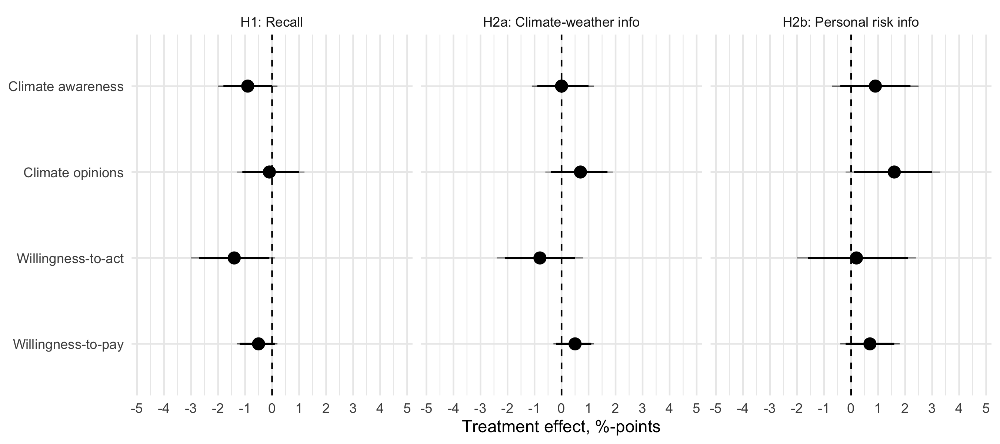
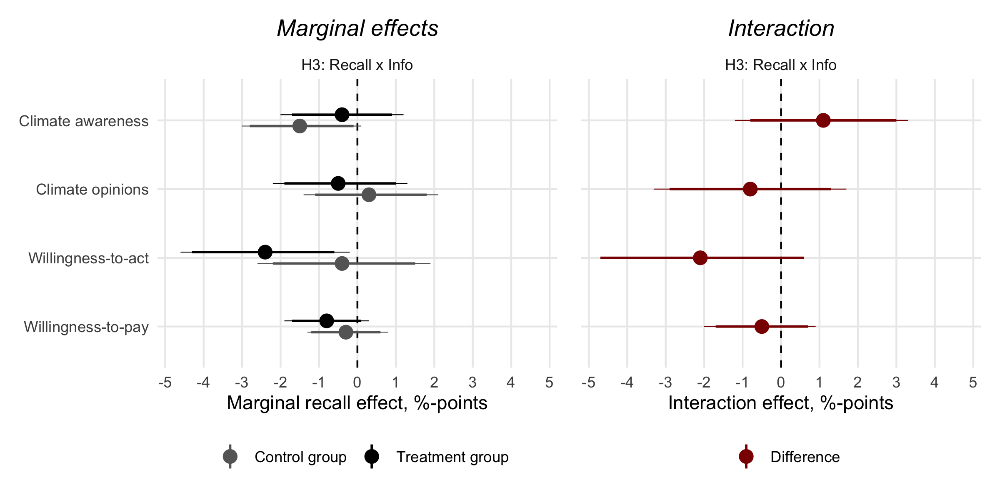
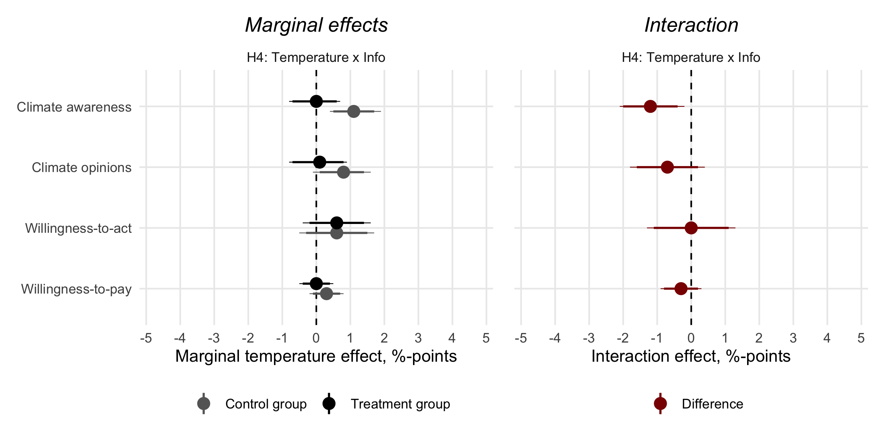
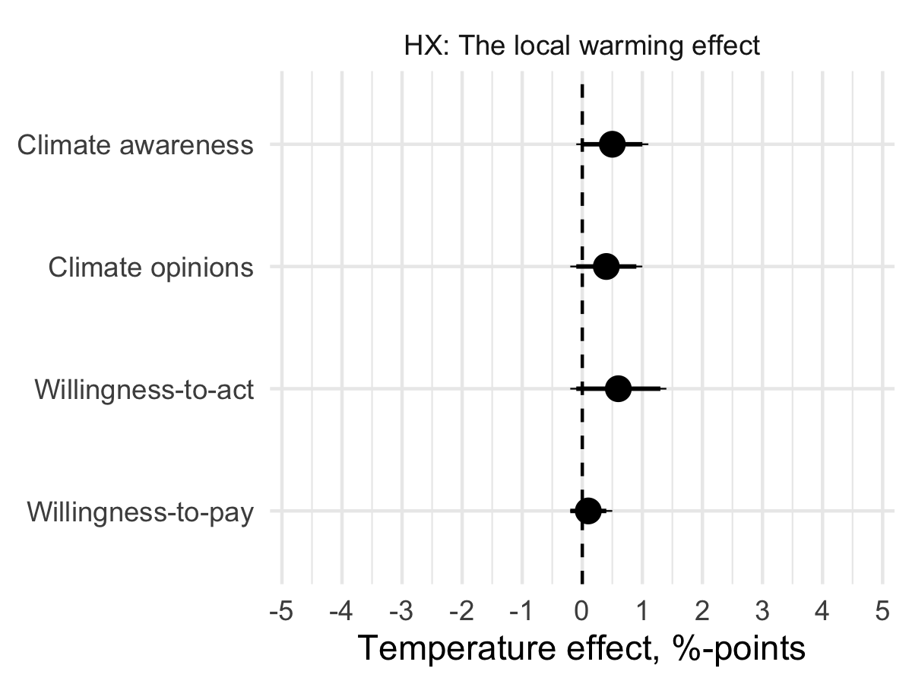
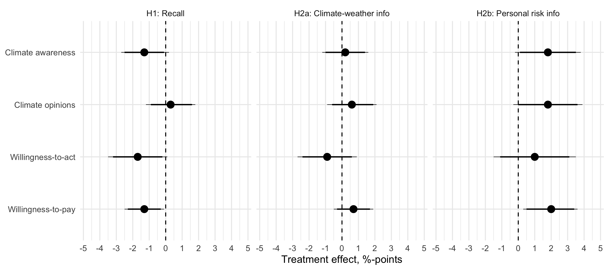
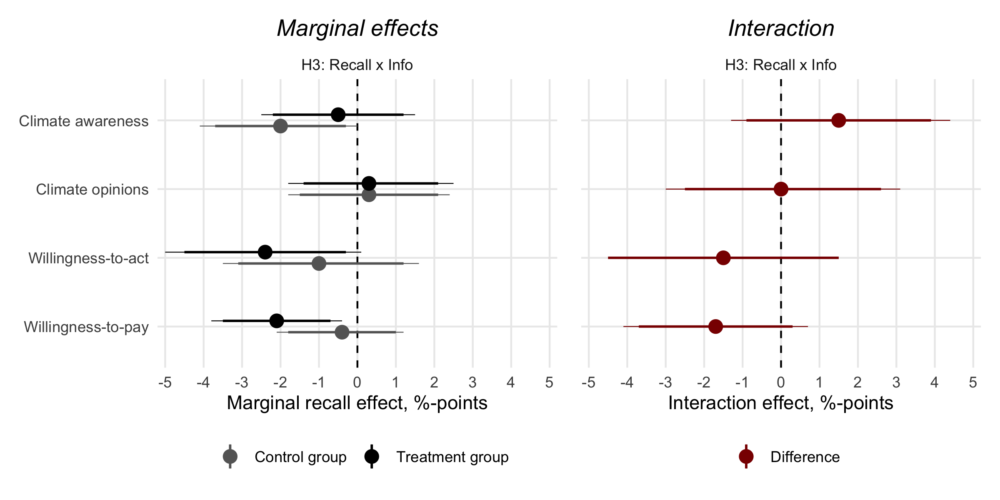
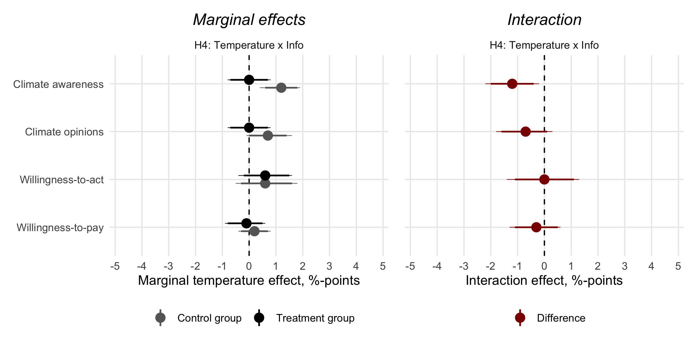
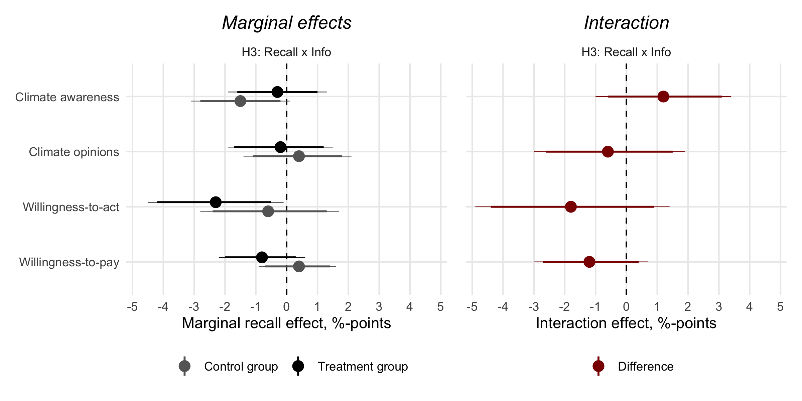
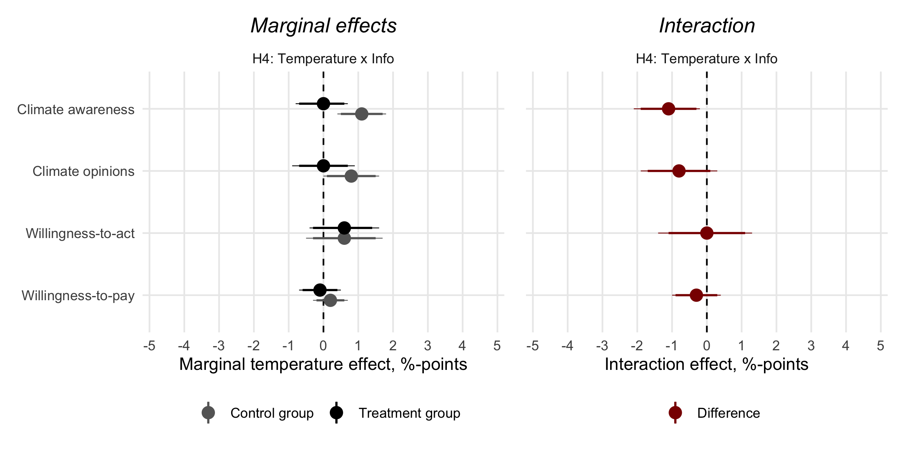
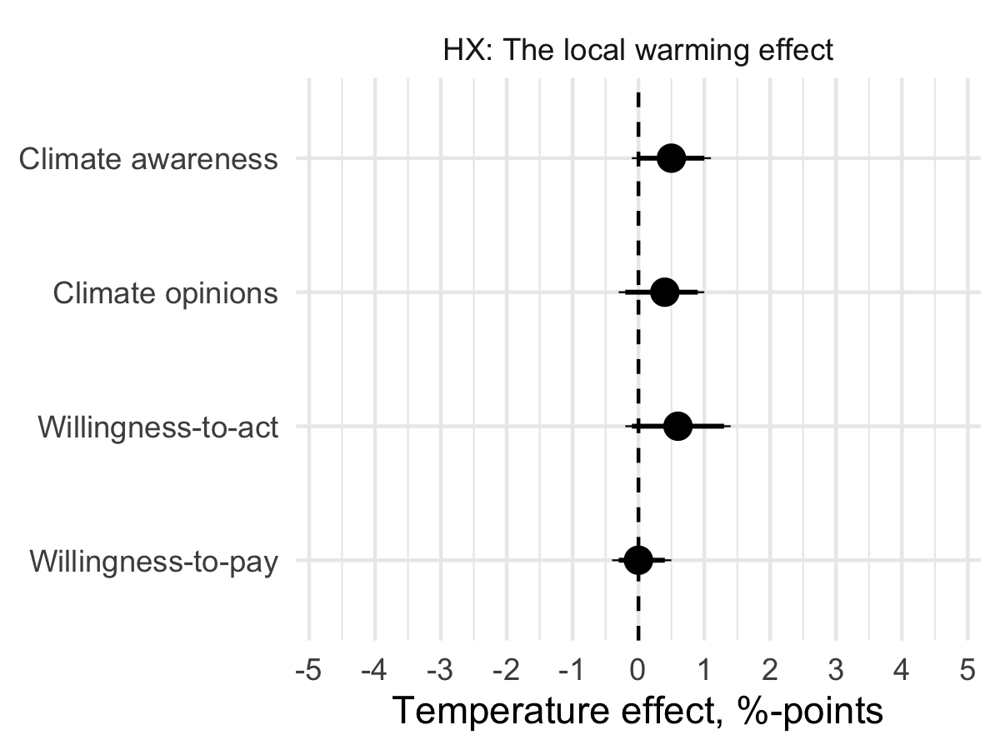

```{r, include = FALSE}
pacman::p_load(tidyverse, 
               knitr, 
               lubridate, 
               kableExtra,
               xaringan,
               xaringanExtra)

knitr::opts_chunk$set(echo = FALSE, 
                      fig.align = "center", 
                      cache = TRUE,
                      out.width="1000px"
)

Sys.setlocale(locale = "da_DK.UTF-8")

xaringanExtra::use_tile_view()
xaringanExtra::use_panelset()
```

```{r xaringan-themer, include=FALSE, warning=FALSE}
library(xaringanthemer)

style_mono_accent(
  # Colors
  base_color = "#8b2325",
  text_color = "#000000", 
  link_color = "#808080", 
  text_bold_color = "#8b2325",
  title_slide_background_color = "#8b2325",
  title_slide_text_color = "#FFFFFF",
  colors = c("white" = "#FFFFFF", "black" = "#000000", "grey" = "#808080", "kingblue" = "#0D0668", "lightgrey" = "#CDCEC6"),
  # Fonts
  text_bold_font_weight = "normal",
  text_font_base = "sans-serif",
  text_font_google = google_font("Metrophobic"),
  code_font_google = google_font("Metrophobic"),
  header_font_google = google_font("Metrophobic"),
  base_font_size = "16pt",
  text_font_size = "16pt",
  code_font_size = "16pt",
  code_inline_font_size = "16pt",
  header_h1_font_size = "30pt",
  header_h2_font_size = "20pt",
  header_h3_font_size = "20pt")

# Ekstra
style_extra_css(
  css = list(
    ".left-column" = list("width" = "33%",
                          "height" = "95%",
                          "float" = "left"),
    ".right-column" = list("width" = "65%",
                           "height" = "95%",
                           #"padding-left" = "1em",
                           "float" = "right")))
```

# The Local Warming Effect

.pull-left[
```{r}
include_graphics("media/damsbopaper.png")
```
[doi.org/10.1080/01402382.2020.1792731](https://doi.org/10.1080/01402382.2020.1792731)
]

.pull-right[
__RQ: How do unusual *temperatures* affect Europeans' *opinions* towards climate change?__

- Direct **experiences** with the weather, independent of elite discourse (?)

- **The local warming effect** is when "deviations in the day’s temperature affect individuals’ global warming beliefs"

- Recent weather experiences as a **heuristic**

- Inspired by Egan & Mullin (2012) and others in the US
]

---

# Data

.pull-left[

- [European Social Survey round 8 (2016)](https://www.europeansocialsurvey.org/data/download.html?r=8)<br>w/ multiple climate question

- _Dependent_ variable: **climate opinion index** (0-100, based on 6 questions)

- _Independent_ variable: **temperature** over the past 7 days compared with "normal" in last 30 years

- Temperatures [observered at country-level](https://www.ecad.eu/) matched with respondents in each country

    - I exclude extremely large/mountainous countries &rarr; 12 remaining countries
]

.pull-right[

```{r kort, warning = FALSE, message = FALSE, dpi=300}
pacman::p_load(tidyverse, sf)

rnaturalearth::ne_countries(continent = "Europe") %>% 
  st_as_sf(crs = 4326) %>%
  select(name) %>% 
  filter(name != "Russia") %>% 
  mutate(temperature_variance = case_when(str_detect(tolower(name), "austria|switz|russia|spain|norway|sweden|israel|slovenia") ~ "high",
                                          str_detect(tolower(name), "finland|france|italy|germany|united kingdom|poland|iceland|hungary|netherland|estonia|lithuania|ireland") ~ "low",
                                          str_detect(tolower(name), "belgium|portugal|czech") ~ "no_weather",
                                          TRUE ~ "no_data")) %>% 
  st_crop(st_bbox(c(xmin = -50, xmax = 30, ymin = 10, ymax = 70))) %>% 
  select(temperature_variance) %>% 
  ggplot() +
  geom_sf(aes(fill = factor(temperature_variance, 
                            levels = c("low", "high", "no_weather", "no_data"), 
                            labels = c("Included", "Excluded (extreme weather variation)", "Excluded (no weather data)", "Excluded (no survey data)"))), 
          color = "black") +
  ggthemes::theme_map() +
  scale_fill_manual(values = c("#00CC66", "#CC0000", "grey30", "grey70")) +
  labs(fill = NULL) 
```
]

???

**Climate opinions index**

1. Do you think the world’s climate is changing?
2. How much have you thought about climate change before today?
3. Do you think that climate change is caused by natural processes, human activity, or both?
4. To what extent do you feel a personal responsibility to try to reduce climate change?
5. How worried are you about climate change?
6. How good or bad do you think the impact of climate change will be on people across the world?

---

# Results (1)

.pull-left[
- Regression analysis of **relationship between temperatures and opinions**

- **&rarr; Result: clear positive association**

- Identifying assumption: **as-if random** allocation of temperature

- Experiences with unusually hot weather _causes strengthened climate opinions_

- Fairly weak effect - but everyone is constantly affected by weather

- Weather experiences as "cheap", readily available information about climate change

]

.pull-right[
```{r}
include_graphics("media/damsboplot.png")
```
]

---

# Results (2)

*Who* is affected by the weather? Who relies on the weather heuristic?

- Two potential moderators: **education** (political awareness, sophistication) and **partisanship** (motivation)

```{r, out.width="80%"}
include_graphics("media/figure2_interactions_education_party.jpg")
```

.center[__&rarr; Result: some suggestive evidence, but no; everyone is affected__]

---

# Results (3)

Is it exclusively a **direct effect of personal experience?** 

- The **media (elites)** could play the role of framing/articulating weather experiences as politically relevant

    - connect weather and climate change &mdash; and provide "indirect experiences"

    - &rarr; the effect would be __larger for people with higher news consumption__

```{r, out.width="68%"}
include_graphics("media/figure3_interaction_news.jpg")
```

.center[__&rarr; Result: suggestive evidence, but no: news exposure makes no difference__]

---
class: middle

# Follow-up study on interaction between experience and mediated information

---

# Follow-up experiment

- Goal: get closer to **interactions between weather experiences and information** that contextualizes personal experience

> Does information, e.g., in the media, moderate effects of weather experience?

- Hard to make great causal designs...

- **Idea:** observe *and* experimentally manipulate __heat-related experiences__ &mdash; and manipulate contextual __information__

- Preregistered **survey experiment** w/ 3024 nat.rep. respondents (Mar-Apr 2022, Denmark)

    - Collaboration w/ [Tobias Heide-Jørgensen](https://politicalscience.ku.dk/staff/phd/?pure=en/persons/436278)

- **Analysis**: direct and interactive treatment effects on four climate-related outcomes

---

# Treatments

.panelset[
.panel[.panel-name[Treatment 0: Temperature]<br>

- Temperature deviations from normal

- Same as in the other paper

- Objective measure of recent personal weather experience

]

.panel[.panel-name[Treatment 1: Recall]<br>

```{r, out.width="60%"}
include_graphics("media/treatment1.png")
```

]

.panel[.panel-name[Treatment 2A: Info]<br>

Now, we will present you with some scientific facts about how climate change creates more extreme weather [...]

- Research shows that human activity contributes to changing the climate and making the weather more extreme.

- New figures show that the temperature in Denmark has already risen by 2.3 degrees Celsius since the 1800s. The main reason is human emissions of greenhouse gases.

- __A warmer climate creates a new normal for the weather, where heat waves, droughts, cloudbursts, and storm floods will be more extreme, more frequent and more prolonged.__ 

- Individual summers can be anything from cool to extremely hot. However, climate change has made the most extreme and __dangerous heat waves 50 times more likely__ compared to the period 1951-1980.

]

.panel[.panel-name[Treatment 2B: Info]<br>

Now, we will present you with some scientific facts about how climate change creates more extreme weather [...]

- Research shows that human activity contributes to changing the climate and making the weather more extreme.

- New figures show that the temperature in Denmark has already risen by 2.3 degrees Celsius since the 1800s. The main reason is human emissions of greenhouse gases.

- __A warmer climate creates a new normal for the weather, where heat waves, droughts, cloudbursts, and storm floods will be more extreme, more frequent and more prolonged.__ 

- Individual summers can be anything from cool to extremely hot. However, climate change has made the most extreme and __dangerous heat waves 50 times more likely__ compared to the period 1951-1980.

- Warmer summers can have __health consequences__ for you and your loved ones, for example in the form of headaches, dizziness, rapid heart rate and breathing, drowsiness, and impaired consciousness

]
]

???

__Recall__

1. How many of the 13 summer weeks – in June, July, and August in 2018 – did you spend in Denmark?
2. Think carefully and describe briefly something you remember from the summer of 2018. For example, it might be an experience or event from your summer holiday or a special feature of the summer.
3. How do you remember the weather in the summer of 2018?

__Information__

1. To what extent is this new knowledge to you?
2. Does it make you see your own weather experiences in a new light?
3. Whether it was new knowledge to you or not, how trustworthy do you think the information was on a scale from 0 to 10, where 10 is completely trustworthy and 0 is completely untrustworthy?

---

# Outcomes

.panelset[
.panel[.panel-name[Climate awareness]<br>

<br>
__Additive index:__

1. Climate change causes major floods in Denmark

2. Virtually all climate scientists agree that climate change is manmade

3. The severity of climate change is often exaggerated

4. I do not worry much about climate change

5. A tax on CO2 emissions should not be introduced

6. I fear that climate change will make large parts of the world uninhabitable for future generations

]

.panel[.panel-name[Climate opinions]<br>

<br>
__Additive index:__

1. Significantly more public resources should be allocated to protect the climate

2. To tackle climate change as soon as possible, I am willing to compromise on other policy issues that are important to me (for example, health care, welfare, or education)

3. Climate change is the biggest challenge of our time

]

.panel[.panel-name[Willingness-to-act]<br>

<br>
<br>

1. How likely do you think it is that you will change your own consumption habits in a significantly greener direction in the coming years for the sake of the climate?

]

.panel[.panel-name[Willingness-to-pay]<br>

<br>
<br>

1. How much money would you be willing to pay in total every month in order to reduce climate change (for example, in the form of higher prices, private donations, etc.)? 

]
]

---

# Hypotheses

- __Hypothesis 1 (H1):__ Recalling the extreme summer weather of 2018 increases climate awareness and pro-climate attitudes and behavior

- __Hypothesis 2a (H2a):__ Scientific information on the link between extreme weather and climate change increases climate awareness and pro-climate attitudes and behavior

- __Hypothesis 2b (H2b):__ The effect of information (H2a) is stronger when information articulates personal(ized) health risks associated with climate change

    - "Warmer summers can have __health consequences__ for you and your loved ones, for example [...]"

## Interactions

- __Hypothesis 3 (H3):__ The __recall effect (H1)__ is strengthened when learning about the climate-weather link

- __Hypothesis 4 (H4):__ The effect of recent exposure to warmer-than-usual temperatures - __"the local warming effect"__ - on climate awareness, opinions, and behavior is larger when combined with information on the climate-weather link

---
layout: true

# Preliminary results

---

> __H1:__ Recalling the extreme summer weather of 2018 increases climate awareness and pro-climate attitudes and behavior

```{r, out.width="85%"}

```

.center[__&rarr; Result: nope, opposite if anything__]

---

> __H2a:__ Scientific information on the link between extreme weather and climate change increases climate awareness and pro-climate attitudes and behavior

```{r, out.width="85%"}

```

.center[__&rarr; Result: nope__]

---

> __H2b:__ The effect of information (H2a) is stronger when information articulates personal(ized) health risks associated with climate change

```{r, out.width="85%"}

```

.center[__&rarr; Result: nope, but almost__]

---

> __H3:__ The recall effect (H1) is strengthened when learning about the climate-weather link

```{r, out.width="75%"}

```

.center[__&rarr; Result: nope, opposite if anything__]

---

> __H4:__ The effect of recent exposure to warmer-than-usual temperatures - "the local warming effect" - on climate awareness, opinions, and behavior is larger when combined with information on the climate-weather link

```{r, out.width="75%"}

```

.center[__&rarr; Result: nope, opposite if anything__]

---

How about __the local warming effect?__ Does it replicate in this (Danish) sample?

```{r, out.width="50%"}

```

.center[__&rarr; Result: nope, but almost (expected pattern)__]

---
layout: false
class: middle

# In sum

- No effects of recall (experience w/ extreme weather), but patterns opposite of hypothesized

- No Local Warming Effect (experience w/ extreme weather), but almost

- No direct information effects, but almost for *personal risk info*

- If anything, information tends to make the recall effect more negative &rarr; *puzzle!*

- Information also tends to completely eliminate the local warming effect

<br>

.center[__&rarr; Overall, no evidence of anticipated interactions between experience and information__]

---
class: middle

# Why did it not work as hypothesized?

- "Cold" information that does not induce affect?

- No knowledge deficit? (many knew the info before)

- Recall of generally pleasant summer experiences (fun-in-the-sun)?

- Geographical setting (priviliged Northern Europe)

- Poor measures of "climate change experience"?

- Thinking consciously about experiences (= poor evidence) eliminates effects?

- Low statistical power...?

---
class: middle, center

# Appendix

---
layout: true

# Raw results without covariates and multiple imputation

---
---

## 1

```{r, out.width="85%"}

```

---

## 2

```{r, out.width="75%"}

```

---

## 3

```{r, out.width="75%"}

```

---

## 4

```{r, out.width="50%"}

```

---
layout: true

# Alternative MI-algorithm: mice instead of Amelia

---
---

## 1

```{r, out.width="85%"}

```

---

## 2 

```{r, out.width="75%"}

```

---

## 3

```{r, out.width="75%"}

```

---

## 4

```{r, out.width="50%"}

```