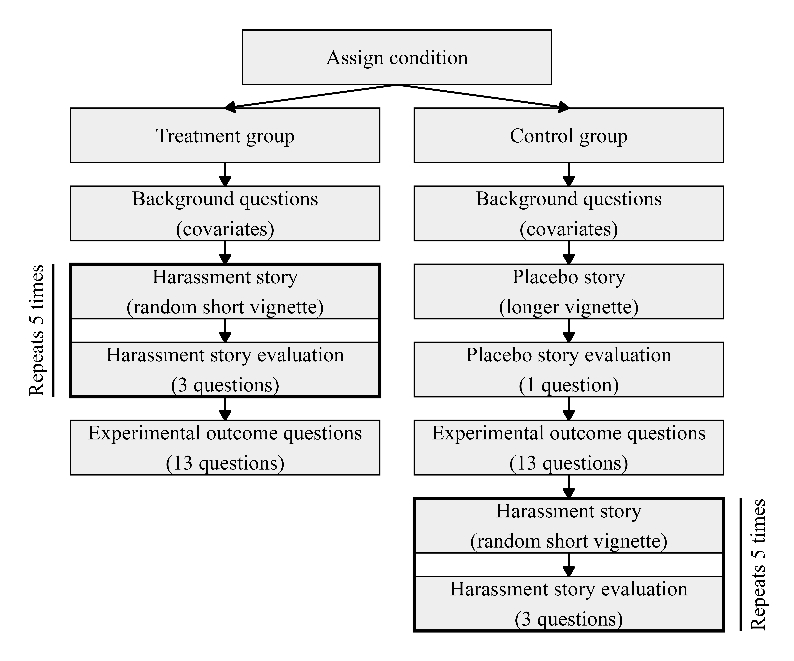
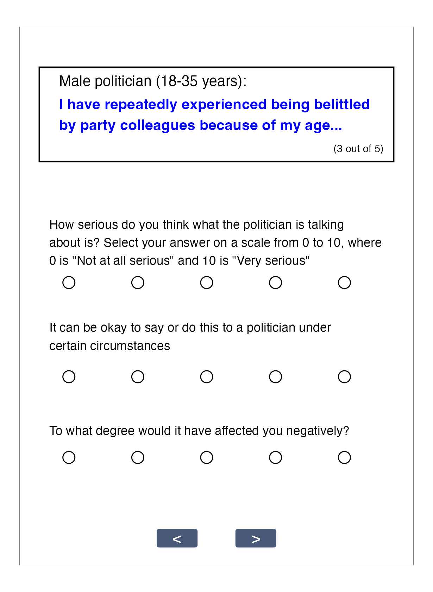
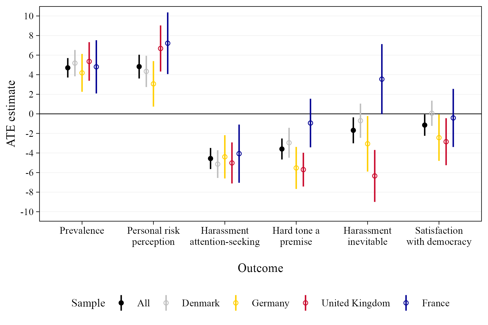
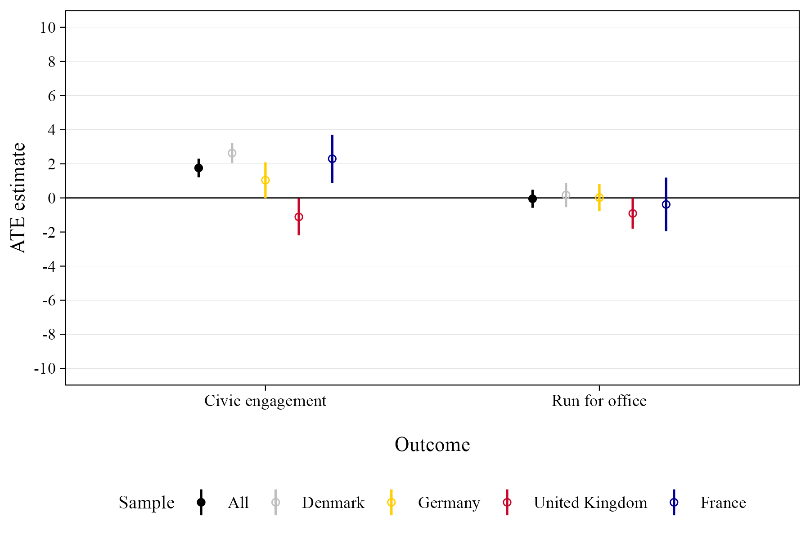
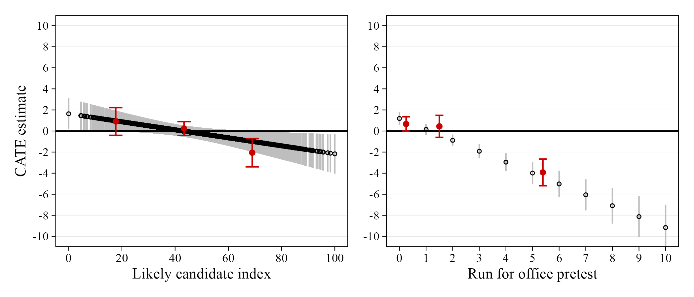

```{r}
#| include: false
pacman::p_load(tidyverse, knitr, lubridate, kableExtra)
sysfonts::font_add_google("Alegreya Sans", "Alegreya Sans", regular.wt = 300)
showtext::showtext_auto()
```

## Motivation

- Growing knowledge about **costs and risks of harassment** to politicians and candidates
    - also direct implications (e.g., stress, behavior, protection, exits)
    - ultimately broader implications: democratic **representation**
    - **experimental/causal evidence** sparse, especially with *citizens*
- _RQ: How do **citizens** respond to **increased awareness** about harassment of politicians?_
- Preregistered **survey experiment**
    - large sample (n = 8,899) with **four European countries**
    - *treatments:* **true harassment stories**
    - *outcomes:* political (dis)**engagement and attitudes** on harassment and democracy
- Implications of increasing awareness could be bad
    - if **citizens are deterred** from considering entering/engaging in politics
    - or if harassment awareness causes **cynicism, backlash, apathy**

## Design

- New multinational preregistered **survey experiment**
- **n = 8,899**
    - Denmark: n = 5,008 (YouGov) 
    - Germany: n = 1,519 (Prolific)
    - United Kingdom: n = 1,515
    - France: n = 857
- **Treatment**
    - **real stories** about (Danish) politicians' experiences with harassment 
    - read and evaluate **5 harassment stories**
    - stimulus sampling design with random draw from 55 curated, paraphrased stories
    - judge stories on three dimensions

## Flowchart

```{r}

```

## How the treatment looks

::: {.nonincremental}

:::: {.columns}
::: {.column width="49%"}

```{r}
#| out-width: 85%

```

:::
::: {.column width="1%"}
:::
::: {.column width="49%"}

<br>

- 1 of 4 **politician** *gender-age* categories (randomized) 

- <span style="color: #0101FF; font-weight: bold;">Story</span>

<br>

- **Judgment** on three dimensions: *seriousness*, *justifiableness*, *harmfulness*

<br>

Repeats five times

:::
::::

:::

## Outcomes

1. Perceived **prevalence** of harassment 
2. Personal **risk** perception
3. Harassment attitude I: **attention** ('*talking abt harassment is abt getting attention*')
4. Harassment attitude II: **hard tone** ('*should have known about the hard tone in politics*')
5. Harassment attitude III: **inevitable** ('*harassment is an inevitable part of politics*')
6. Satisfaction with **democracy**
7. Willingness to **engage** in six political activities (*additive index*)
8. Willingness to **run for office** in the future (*main outcome*)

# Results {background-color="#026B81"}

## Effects on perceived prevalence and risk (1-2)

:::: {.columns}
::: {.column width="65%"}

```{r}

```

:::
::: {.column width="2%"}
:::
::: {.column width="33%"}

- 4.7 %-points *increase* in perceived **prevalence**
- 4.8 %-points *increase* in personal **risk perception**

:::
::::

## Effect on harassment attitudes (3-5)

:::: {.columns}
::: {.column width="65%"}
```{r}

```

:::
::: {.column width="2%"}
:::
::: {.column width="33%"}

- 4.6 %-point *decrease* in belief that politicians' harassment stories are **about getting attention**
- 3.6 %-point *decrease* in belief that politicians **should have known about hard tone**
- 1.7 %-point *decrease* in belief that **harassment is inevitable**

:::
::::

## Effect on satisfaction with democracy (6)

:::: {.columns}
::: {.column width="65%"}
```{r}

```

:::
::: {.column width="2%"}
:::
::: {.column width="33%"}

- 1.1 %-point *decrease* in general **satisfaction with democracy** (p = 0.040)

:::
::::

## Effect on political engagement

> *Main hypothesis: People become __politically disengaged__ and __less likely to run for office__ when they hear stories about harassment against politicians*

## Effect on political engagement

> *Main hypothesis: People become __politically disengaged__ and __less likely to run for office__ when they hear stories about harassment against politicians*

:::: {.columns}
::: {.column width="65%"}

```{r}

```

:::
::: {.column width="2%"}
:::
::: {.column width="33%"}

- No decline in **civic engagement** (7)
- Instead, 1.8 %-points *increase* (e.g., **contact politician**, **demonstrate**, petition, SoMe post)
- Uneven effects &rarr; not very robust

:::
::::

## Effect on political engagement

> *Main hypothesis: People become __politically disengaged__ and __less likely to run for office__ when they hear stories about harassment against politicians*

:::: {.columns}
::: {.column width="65%"}

```{r}

```

:::
::: {.column width="2%"}
:::
::: {.column width="33%"}

- No *average* decline in willingness to **run for office** in the future (p = 0.851)
- However, this (null) effect is **heterogeneous**
- Different for likely and unlikely future candidates &rarr;

:::
::::

## Effect on political engagement of likely candidates

> *Main hypothesis: People become __politically disengaged__ and __less likely to run for office__ when they hear stories about harassment against politicians*

- Some citizens are more likely than others to consider a political career
- Arguably more consequential what the (conditional) effects are<br>among more likely candidates
- Categorize citizens as **'likely candidates'** using two approaches:
    1. create an additive **index** from<br>(a) political interest, (b) partisanship, (c) internal efficacy, (d) external efficacy
    2. measure willingness to run *pre-treatment*
- ~16 percent (1/6) categorized as 'likely candidates'
- Analyze *conditional effects* among these two groups of likely candidates

## Effect on political engagement of likely candidates

```{r}
#| out-width: 120%

```

- Statistically significant negative **interaction** with conditional effects (CATEs):
    - 2.0 %-points *decrease* for **high index values**
    - 3.9 %-points *decrease* for **high reported pre-tests**
    - Null for the *unlikely* categories
- In sum, evidence that **harassment in politics does in fact<br>scare away the most likely future candidates**

# Conclusions {background-color="#026B81"}

- What are the effects of raising awareness about politicians' harassment experiences?
- For citizens from four European democracies, it causes: 
    - higher harassment risk perception
    - higher acknowledgement and lower acceptance
    - more civic engagement
    - arguably good outcomes, but ...
- **Citizens** are also **potential candidates** of the future 
    - no *average* impact on citizens' **willingness to run for office** (arguably good)
    - but **harassment clearly affects more likely candidates**
    - **modest conditional effect** around -2-4 %-points
    - but potential candidates on the margin are likely **important for representation**

# Thank you {background-color="#026B81"}