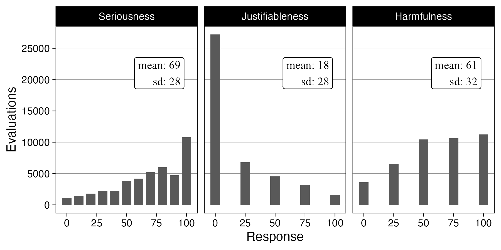

```{r}
#| include: false
pacman::p_load(tidyverse, knitr, lubridate, kableExtra)
sysfonts::font_add_google("Alegreya Sans", "Alegreya Sans", regular.wt = 300)
showtext::showtext_auto()
```

## Motivation

- Growing knowledge about **costs and risks of harassment** to politicians and candidates
    - also about implications in terms of stress, behavior, protection, exits
    - ultimately about democratic **representation**
    - **experimental (causal) evidence** is sparse, especially on *citizens*
- _RQ: How do **citizens** respond to **increased awareness** about harassment of politicians?_
- Preregistered **survey experiment**
    - large sample with **four European countries**
    - *treatments:* **true harassment stories**
    - *outcomes:* political (dis)**engagement and attitudes** on harassment and democracy
- Increasing awareness of harassment could have **bad implications**
    - if **citizens are deterred** from considering entering/engaging in politics
    - or if harassment awareness causes **cynicism, backlash, or apathy**

## Design

- New multinational preregistered **survey experiment**
- **n = 8,899**
    - Denmark: n = 5,008 (YouGov) 
    - Germany: n = 1,519 (Prolific)
    - United Kingdom: n = 1,515
    - France: n = 857
- **Treatment**
    - **real stories** about (Danish) politicians' experiences with harassment 
    - stimulus sampling design
    - read and evaluate **5 harassment stories**
        - random draw from 55 curated, paraphrased stories
    - story **evaluation**: *seriousness*, *justifiableness*, *harmfulness*

## Outcomes

:::: {.columns}
::: {.column width="53%"}

1. Perceived **prevalence** and personal **risk** 
2. Three attitudes towards **harassment** in politics
3. Satisfaction with **democracy**

4. Willingness to **run for office** in the future
5. **Index** of willingness to **engage** in six political activities

:::
::: {.column width="2%"}
:::
::: {.column width="45%"}

```{r}
include_graphics("media/flowchart_new.png")
```

:::
::::

## Treatment: 5/55 harassment stories^[*Source: Danish 2021 municipal election candidate survey (n = 3,986, response rate 42%)*] {background-color="beige"}


. . .

> "I have experienced my election posters being 'decapitated' by unknown persons. My children, aged seven and nine, have seen this, which was very unpleasant."

. . .

> "I have experienced unpleasant advances in private messages on social media from people of all ages."

. . .

> "I have received death threats from unknown senders directed at both my little brothers and my own children."

. . .

> "There was a citizen who drove around in a car and measured how high my - and only my - posters were placed from the ground. He then reported me to the police for banners that were placed too low."

## Treatment: example {background-color="beige"}

::: {.nonincremental}

:::: {.columns}
::: {.column width="57%"}

<br>

1. 1 of 4 **politician** *gender-age* groups (randomized) 
2. **Story**

<br>

3. Three **evaluation** questions

<br>

*Repeats 5 times...*

:::
::: {.column width="1%"}
:::
::: {.column width="42%"}

```{r}
#| fig-cap: "Treatment example (1 out of 5) in Danish"
include_graphics("media/treatment-example.png")
```

:::
::::

:::

## Story evaluations {background-color="beige"}

:::: {.columns}
::: {.column width="85%"}
```{r}
#| fig-cap: "Evaluations of 43,460 harassment stories"

```
:::
::: {.column width="2%"}
:::
::: {.column width="49%"}

:::
::::

# Results {background-color="#026B81"}

## Effects of raising awareness on harassment attitudes

::: {.nonincremental}

:::: {.columns}
::: {.column width="65%"}
```{r}
knitr::include_graphics("media/main_effects_new_A.png")
```
:::
::: {.column width="2%"}
:::
::: {.column width="33%"}

- 4.7 %-points *increase* in perceived **prevalence**
- 4.8 %-points *increase* in personal **risk perception**

:::
::::

::: 

## Effects of raising awareness on harassment attitudes

:::: {.columns}
::: {.column width="65%"}
```{r}
knitr::include_graphics("media/main_effects_new_A.png")
```
:::
::: {.column width="2%"}
:::
::: {.column width="33%"}

- 4.6 %-point *decrease* in belief that politicians' harassment stories are **about getting attention**
- 3.6 %-point *decrease* in belief that politicians **should have known about hard tone**
- 1.7 %-point *decrease* in belief that **harassment is inevitable** (p = 0.013)
- 1.1 %-point *decrease* in general **satisfaction with democracy** (p = 0.040)

:::
::::

## Effects of raising awareness on political engagement

> *Main hypothesis: People become __politically disengaged__ and __less likely to run for office__ when they hear stories about harassment against politicians*

## Effects of raising awareness on political engagement

> *Main hypothesis: People become __politically disengaged__ and __less likely to run for office__ when they hear stories about harassment against politicians*

:::: {.columns}
::: {.column width="65%"}
```{r}
knitr::include_graphics("media/main_effects_new_B.png")
```
:::
::: {.column width="2%"}
:::
::: {.column width="33%"}

- No average decline in willingness to **run for office** (p = 0.851)
- No decline in **civic engagement**
- 1.8 %-points *increase* in **participation in six political activities** (e.g., contact politician, protest, petition, SoMe post)

:::
::::

## Deeper dive on **run for office** (RFO) outcome

- Some citizens are more likely than others to consider a political career
- We create additive **index** of (1) political interest, (2) partisanship, (3) internal efficacy, and (4) external efficacy
    - we also measure **pre-treatment** willingness to RFO
- We find statistically significant negative **interaction** with treatment (CATEs ... &darr;):
    - 2.0 %-points RFO *decrease* for ~1/6 **highest index values** (between subjects)  
    - 3.9 %-points RFO *decrease* for ~1/6 **highest reported pre-tests** (between subjects) 
    - 5.4 %-points RFO *decrease* for ~1/6 **highest index values** (*within* treated subjects)
    - (No conditional effects for groups with __lower likelihood of running__)
- In sum, evidence that *the most likely future candidates* may in fact be **scared away**
    - but arguably still modest effect

# Conclusions {background-color="#026B81"}

- What are the effects of raising awareness about politicians' real harassment experiences?
- Across four European democracies, it causes: 
    - higher acknowledgement of harassment
    - lower acceptance
    - more civic engagement
    - good, but ...
- Citizens are also potential candidates of the future. Does it affect their **willingness to run for office?**
    - on average, **no** (arguably good)
    - but clear indications that **it does** for the more **likely candidates**
    - however, fairly modest (conditional) **effect size**: ~2-5 %-points


# Thank you {background-color="#026B81"}