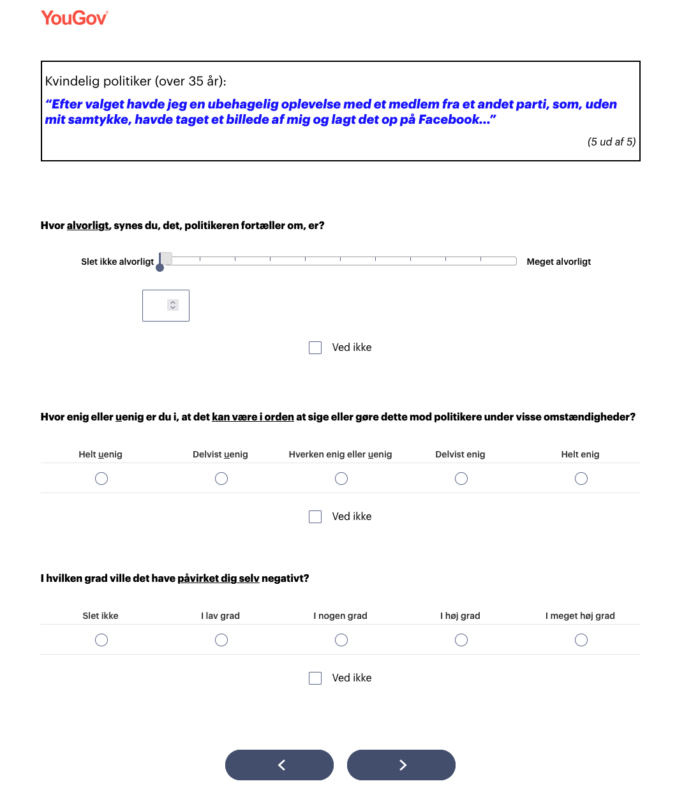
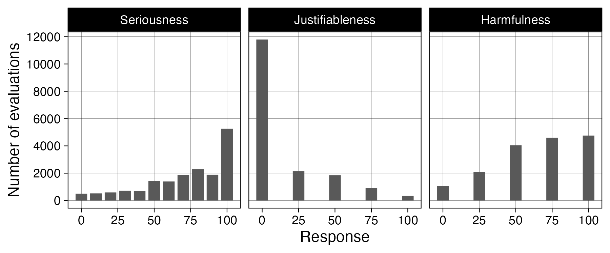

```{r}
#| include: false
pacman::p_load(tidyverse, knitr, lubridate, kableExtra)
sysfonts::font_add_google("Alegreya Sans", "Alegreya Sans", regular.wt = 300)
showtext::showtext_auto()
```

## Purpose

1. Explore how citizens react to politicians' true stories of harassment
2. Test if certain sociopolitical groups evaluate harassment as **more or less serious** <br>(also more or less **justifiable** and personally **harmful**)
3. Test if learning about harassment causes political disengagement and reduces willingness to run for office

## Design

::: {.incremental}

- Approx. 5,000 respondents (so far, we received 3,500)
- Descriptive and causal
- **Treatment** = read and evaluate 5 random stories from pool of 55 curated stories
    - **Evaluation** of seriousness, justifiableness, harmfulness
- (Causal) outcomes: 
    - perceived prevalence (manipulation check), fear of exposure
    - attitudes on harassment in politics
    - likelihood of running for office, engaging in political activities
    - satisfaction with democracy
    - gender and age leadership attitudes
- Preregistered!

:::

## Design

```{r}
include_graphics("media/flowchart.png")
```

## 55 harassment stories

Source: Danish 2021 municipal election candidate survey

. . .

> "I have experienced my election posters being 'decapitated' by unknown persons. My children, aged seven and nine, have seen this, which was very unpleasant..."

. . .

> "I have experienced unpleasant advances in private messages on social media from people of all ages..."

. . .

> "I have been exposed to a candidate from another party starting nasty rumors about me and my candidacy"

. . .

> "One person told me that my family and I were 'going to the gas chamber'..."

## 3 evaluation questions

```{r}

```

## 3 evaluation questions --- results

```{r}

```

# Hypotheses and preliminary findings {background-color="#026B81"}

We have received and partly analyzed 2/3 survey responses

## Descriptive

> *H1: Harassment against politicians is perceived as (i) more serious, (ii) less justifiable, and (iii) more personally harmful by:*

**Main**

a. unlikely future candidates compared to likely future candidates
b. women compared to men
c. young people (age 18-35) compared to older individuals (above age 35)
d. people who belong to the same (age-gender) group as the target compared to people who do not
e. individuals who self-identify as ideologically left-leaning compared to right-leaning individuals

## Descriptive

> *H1: Harassment against politicians is perceived as (i) more serious, (ii) less justifiable, and (iii) more personally harmful by:*

**unlikely future candidates compared to likely future candidates**

- i. No, *less* serious
- ii. No
- iii. Yes

## Descriptive

> *H1: Harassment against politicians is perceived as (i) more serious, (ii) less justifiable, and (iii) more personally harmful by:*

**women compared to men**

- i. Yes
- ii. Yes
- iii. Yes, much more

## Descriptive

> *H1: Harassment against politicians is perceived as (i) more serious, (ii) less justifiable, and (iii) more personally harmful by:*

**young people (age 18-35) compared to older individuals (above age 35)**

- i. No, *less* serious
- ii. No
- iii. No

## Descriptive

> *H1: Harassment against politicians is perceived as (i) more serious, (ii) less justifiable, and (iii) more personally harmful by:*

**people who belong to the same (age-gender) group as the target compared to people who do not**

- i. No
- ii. No
- iii. No

(however, *yes* for women: i, iii)

## Descriptive

> *H1: Harassment against politicians is perceived as (i) more serious, (ii) less justifiable, and (iii) more personally harmful by:*

**individuals who self-identify as ideologically left-leaning compared to right-leaning individuals**

- i. Yes
- ii. Yes
- iii. Yes

## Descriptive --- supplementary (respondent)

> *H1: Harassment against politicians is perceived as (i) more serious, (ii) less justifiable, and (iii) more personally harmful:*

. . .

**by conflict avoidant individuals (high conflict avoidance) compared to others**

- i. Yes
- ii. Yes
- iii. Yes

## Descriptive --- supplementary (respondent)

> *H1: Harassment against politicians is perceived as (i) more serious, (ii) less justifiable, and (iii) more personally harmful:*

**by individuals who do not enjoy conflict (low conflict approach) compared to others**

- i. Yes
- ii. Yes
- iii. Yes

## Descriptive --- supplementary (respondent)

> *H1: Harassment against politicians is perceived as (i) more serious, (ii) less justifiable, and (iii) more personally harmful:*

**by people who fear personal exposure to harassment in politics compared to people who do not**

- i. Yes
- ii. Yes
- iii. Yes

## Descriptive --- supplementary (respondent)

> *H1: Harassment against politicians is perceived as (i) more serious, (ii) less justifiable, and (iii) more personally harmful:*

**by individuals who believe harassment, intimidation, and a harsh tone are integral to politics compared to individuals who do not**

- i. Yes
- ii. Yes
- iii. Yes

## Descriptive --- supplementary (respondent)

> *H1: Harassment against politicians is perceived as (i) more serious, (ii) less justifiable, and (iii) more personally harmful:*

**by individuals who are generally satisfied with democracy compared to individuals who are dissatisfied**

- i. Yes
- ii. Yes
- iii. Yes

## Descriptive --- supplementary (respondent)

> *H1: Harassment against politicians is perceived as (i) more serious, (ii) less justifiable, and (iii) more personally harmful:*

**by individuals who are easily *not* easily angered by contrary viewpoints...**

- i. No
- ii. Yes 
- iii. No, *less* harmful 

## Descriptive --- supplementary (target)

> *H1: Harassment against politicians is perceived as (i) more serious, (ii) less justifiable, and (iii) more personally harmful:*

. . .

**when the target is a woman compared to a man**

- i. Yes
- ii. Yes
- iii. Yes

## Descriptive --- supplementary (target)

> *H1: Harassment against politicians is perceived as (i) more serious, (ii) less justifiable, and (iii) more personally harmful:*

**when the target is a young politician (age 18-35) compared to an older politician (above age 35)**

- i. No
- ii. No
- iii. No

## Descriptive --- supplementary (story)

> *H1: Harassment against politicians is perceived as (i) more serious, (ii) less justifiable, and (iii) more personally harmful:*

. . .

**when the story is about physical harassment or threats**

- i. Yes, *much* more
- ii. Yes, *much* less
- iii. Yes, *much* more

## Descriptive --- supplementary (story)

> *H1: Harassment against politicians is perceived as (i) more serious, (ii) less justifiable, and (iii) more personally harmful:*

**when the story is evaluated as more serious by others**

- i. (Perfect correlation)
- ii. Yes
- iii. Yes

## Descriptive --- supplementary (story)

> *H1: Harassment against politicians is perceived as (i) more serious, (ii) less justifiable, and (iii) more personally harmful:*

**when the story is about sexual harassment**

- i. No
- ii. Yes
- iii. No, *less* harmful

## Descriptive --- supplementary (story)

> *H1: Harassment against politicians is perceived as (i) more serious, (ii) less justifiable, and (iii) more personally harmful:*

**when the story is about harassment by someone from within the political system **

- i. No, *less* serious
- ii. No, *more* justifiable
- iii. No, *less* harmful

Harassment from citizens/strangers is perceived as much more problematic!

## Descriptive --- supplementary (story)

> *H1: Harassment against politicians is perceived as (i) more serious, (ii) less justifiable, and (iii) more personally harmful:*

**when the story is about harassment outside the social media arena**

- i. Yes, *much* more
- ii. Yes, *much* less
- iii. Yes, *much* more

# Causal effects of learning about harassment {background-color="#026B81"}

## Causal

> *H2: People become politically disengaged and less likely to run for office when they hear stories about harassment against politicians*

. . .

**first, a manipulation check** 

- 5%-points higher guess in politician % that experience harassment (63% vs. 58%)
- 5%-points higher fear of personal exposure

## Causal

> *H2: People become politically disengaged and less likely to run for office when they hear stories about harassment against politicians*

**Harassment in politics**

- Reduction in belief that _harassment is inevitable_
- Reduction in belief that _politicians should have known_ about hard tone
- Large reduction in belief that politicians talk of _harassment to get attention_

## Causal

> *H2: People become politically disengaged and less likely to run for office when they hear stories about harassment against politicians*

**Preference for men or young political leaders**

- Large reduction in belief that _age 36+ are better political leaders_
- No effect on belief that _men are better political leaders_

## Causal

> *H2: People become politically disengaged and less likely to run for office when they hear stories about harassment against politicians*

**Future participation (likelihood of engaging in 6 political activities, e.g., protest, petition, SoMe post)**

- No disengagement
- Instead, an *increase* in participation

## Causal

> *H2: People become politically disengaged and less likely to run for office when they hear stories about harassment against politicians*

**Willingness to run (likelihood of running for office in future)**

- no effect

**Satisfaction with democracy**

- no effect

## Conclusions {background-color="#026B81"}

::: {.incremental}
- Lots (!) of things build into survey :)
- Many **descriptive** expectations hold completely
- **Causal** hypothesis holds for many outcomes
- Important: unexpected results for **likely future candidates** &rarr; not the recruitment/composition story, we were planning
- Two papers?
- (Lots of things, yes, but also many possible extensions...)
:::

## Thank you! {background-color="#026B81"}