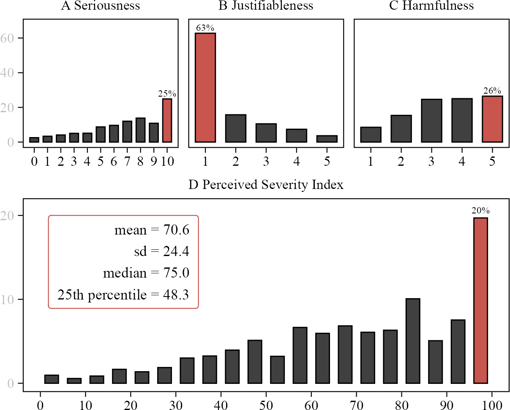

```{r}
#| include: false
pacman::p_load(tidyverse, knitr, lubridate, kableExtra)
sysfonts::font_add_google("Alegreya Sans", "Alegreya Sans", regular.wt = 300)
showtext::showtext_auto()
```

## Motivation

- There is both loose **conjecture** (e.g., political debate) and careful **theory** about *heterogeneous perceptions of harassment among citizens*
- But little **solid empirical evidence**
    - 'solid': large/broad *data collection* and broad *'harassment' concept*
- __RQ: *How severe is harassment* against politicians to citizens, and what are theoretically and statistically significant *gaps in perceptions* of harassment?__
    - i.e., are (harassed) politicians perceived as *snowflakes* or *tough cookies*? By whom?
- Preregistered **survey:**
    - large sample (n = 8,899) from **4 European countries**
    - 55 **true stories** of (Danish) politicians' experiences with harassment
    - **outcome**: perceived severity
    - 43,460 judgments of a diverse set of harassment stories

## Status

- First draft
- Data part of larger project with experiment
- **Analysis** quite broad/deep and quite far
    - main results 'final'
    - possibly need for **cuts**, possibility for **extensions**
    - **gender and age** weaved into every analysis for coherence
- Framing and especially **theory** quite underdeveloped
    - we'd love to hear some of your takes on our findings

## Design

- New multinational preregistered **survey**
- **n = 8,899 respondents**
    - Denmark: n = 5,008 (YouGov) 
    - Germany: n = 1,519 (Prolific)
    - United Kingdom: n = 1,515
    - France: n = 857
- **Harassment stories**
    - respondents read and evaluate **5 harassment stories**
    - real stories about (Danish) politicians' experiences with harassment
    - source: Danish 2021 municipal election candidate survey (n = 3,986) 
    - *stimulus sampling* design with random draw from **55 curated stories**
    
    

## Examples of harassment stories {background-color="#FCF2CC"}

> "I have experienced my election posters being 'decapitated' by unknown persons. My children, aged seven and nine, have seen this, which was very unpleasant."

. . .

> "I have experienced unpleasant advances in private messages on social media from people of all ages."

. . .

> "I have received death threats from unknown senders directed at both my little brothers and my own children."

. . .

> "There was a citizen who drove around in a car and measured how high my - and only my - posters were placed from the ground. He then reported me to the police for banners that were placed too low."

## How the stories are presented and judged {background-color="#FCF2CC"}

::: {.nonincremental}

:::: {.columns}
::: {.column width="49%"}

```{r}
#| out-width: 85%
include_graphics("media/new_treatment-example.png")
```

:::
::: {.column width="1%"}
:::
::: {.column width="49%"}

<br>

- 1 of 4 **politician** *gender-age* categories (randomized) 

- <span style="color: #0101FF; font-weight: bold;">Story</span>

<br>

- **Judgment** on three dimensions: *seriousness*, *justifiableness*, *harmfulness*

<br>

Repeats five times

:::
::::

:::

## Perceived severity

:::: {.columns}
::: {.column width="42%"}

```{r}

```

:::

::: {.column width="2%"}
:::
::: {.column width="56%"}
- Judgments are combined into a **severity index**
- I.e., respondents de facto rate each story's severity from 0 to 100
- => 43,460 judgments of 55 harassment stories
- **Analytic focus:** theoretically and statistically significant **gaps in perceived severity** by key explanatory variables 
    - a.k.a. *predictors*, *covariates*
    - e.g., gender, ideology, risk perception
    - **four 'themes'** &rarr;
:::
::::

## Explanatory variables -- four themes  {background-color="#CCE3F3"}

::: {.nonincremental}

:::: {.columns}
::: {.column width="49%"}

- **A Gender and age**
   1. gender
   2. age
   3. gender-age
   4. politicians' gender-age 
   5. gender-age affinity

- **B Ideology**
   6. left-right placement (general)
   7. harassment attitudes (specific)
:::
::: {.column width="49%"}

- **C Risk and likely candidates**
   8. harassment risk perception
   9. general conflict aversion
   10. likely candidate (predicted)
   11. likely candidate (expressed ambition)

- **D Harassment type**
   12. physical harassment, violence (threats), vandalism (non-person)
   13. sexual harassment
   14. social media (arena)
   15. system-insider (source)

:::
::::

:::

# Results: A Gender and age {background-color="#026B81"}

## Gender gap in perceived severity?

<br>

:::: {.columns}
::: {.column width="80%"}

```{r}

img_path <- "media/gender0.png"
img_path |>
  magick::image_read() |>
  magick::image_trim() |>
  magick::image_write(img_path)

knitr::include_graphics(img_path)
```

:::
::::

## A Gender and age

:::: {.columns}
::: {.column width="60%"}

```{r}
#| out-width: 92%

img_path <- "media/genderage_combined.png"
img_path |>
  magick::image_read() |>
  magick::image_trim() |>
  magick::image_write(img_path)

knitr::include_graphics(img_path)

```

:::
::: {.column width="2%"}
:::
::: {.column width="38%"}

- A: Higher severity for **women**
- B: Lower severity for **young**
- C: Highest severity for **older women**, lowest for young men
- D: Highest severity when **politician** (target) is **young woman**, lowest when older man

:::
::::

## A Gender-age affinity

:::: {.columns}
::: {.column width="60%"}

```{r}
#| out-width: 92%

img_path <- "media/genderage-affinity_combined.png"
img_path |>
  magick::image_read() |>
  magick::image_trim() |>
  magick::image_write(img_path)

knitr::include_graphics(img_path)

```

:::
::: {.column width="2%"}
:::
::: {.column width="38%"}

- A: Subset to stories with **gender-age affinity** (~25%)
- A: Gaps similar to full sample
- B: Gender-age affinity causes higher severity for **women**
- B: Gender-age affinity causes lower severity for **older men**
- B: Largely driven by perceptions related to **politician's identity**

:::
::::

# Results: B Ideology  {background-color="#026B81"}

## B Ideology

:::: {.columns}
::: {.column width="60%"}

```{r}
#| out-width: 92%

img_path <- "media/ideology_combined.png"
img_path |>
  magick::image_read() |>
  magick::image_trim() |>
  magick::image_write(img_path)

knitr::include_graphics(img_path)

```

:::
::: {.column width="2%"}
:::
::: {.column width="38%"}

- A: Higher severity for **left-leaning** respondents
- B: Higher severity for respondents with clear **anti-harassment** attitudes
- &rarr; Specific harassment-related ideology more important than general ideological leaning
- Ideological gaps ~2-4 %-points smaller for women


:::
::::

# Results: C Risk and likely candidates {background-color="#026B81"}

## C Risk and likely candidates

:::: {.columns}
::: {.column width="60%"}

```{r}
#| out-width: 92%

img_path <- "media/risk_combined.png"
img_path |>
  magick::image_read() |>
  magick::image_trim() |>
  magick::image_write(img_path)

knitr::include_graphics(img_path)

```

:::
::: {.column width="2%"}
:::
::: {.column width="38%"}

- A: Higher severity for respondents with high **risk perceptions**
- B: Higher severity for respondents with high **conflict avoidance**
- C: Higher severity for **likely future candidates** (index),<br>but ...
- D: Lower severity for citizens with **expressed political ambition** (??)

:::
::::

## C Risk and likely candidates

:::: {.columns}
::: {.column width="50%"}

<br>

```{r}
#| out-width: 75%

img_path <- "media/likely_candidate.png"
img_path |>
  magick::image_read() |>
  magick::image_trim() |>
  magick::image_write(img_path)

knitr::include_graphics(img_path)

```

:::
::: {.column width="2%"}
:::
::: {.column width="48%"}

- We **interact the two measures** of potential candidates
- *Within each x-axis category* ('resources'^[Likely future candidate index: (i) political interest, (ii) partisanship, (iii) internal and (iv) external efficacy.], or predicted likelihood of running for office)
    - lower severity for those with **expressed political ambition**
- *Within each color category* (expressed political ambition)
    - higher severity for those with **higher index values**

:::
::::

## C Risk and likely candidates

::: {.nonincremental}

:::: {.columns}
::: {.column width="50%"}

<br>

```{r}
#| out-width: 75%

img_path <- "media/likely_candidate.png"
img_path |>
  magick::image_read() |>
  magick::image_trim() |>
  magick::image_write(img_path)

knitr::include_graphics(img_path)

```

:::
::: {.column width="2%"}
:::
::: {.column width="48%"}

- **Plausible interpretation**: 
    - those who actively consider politics (*expressed ambition*) have factored harassment in, devalued the severity, are less surprised
    - or, due to self-selection, they have 'thicker skin' to begin with
- **Raises questions**:
    - about who's willing to run/stay
    - about whether/when/how candidates' perceptions of harassment change

:::
::::

:::

# Results: D Harassment type {background-color="#026B81"}

## D Harassment type

:::: {.columns}
::: {.column width="60%"}

```{r}
#| out-width: 75%

img_path <- "media/story_combined.png"
img_path |>
  magick::image_read() |>
  magick::image_trim() |>
  magick::image_write(img_path)

knitr::include_graphics(img_path)

```

:::
::: {.column width="2%"}
:::
::: {.column width="38%"}

- A-B: higher severity for stories of **physical harassment** and (threats of) violence
- C: Lower severity for stories of **vandalism** (i.e., higher when target is a person) 
- D: No gap for **sexual** vs. non-sexual harassment
- D: But large positive gap for **young** and small negative gap for older people

:::
::::

## D Harassment type

:::: {.columns}
::: {.column width="60%"}

```{r}
#| out-width: 75%

img_path <- "media/story_combined.png"
img_path |>
  magick::image_read() |>
  magick::image_trim() |>
  magick::image_write(img_path)

knitr::include_graphics(img_path)

```

:::
::: {.column width="2%"}
:::
::: {.column width="38%"}

- E: Lower severity for stories in **social media** arena
- E: Especially among **young people** (gap smaller among women)
- F: Lower severity when **party colleague** is 'source'<br>(more excusable?)
- F: Gap smaller among women

:::
::::

## Summary of gaps {background-color="#CCE3F3"}

::: {.nonincremental}

:::: {.columns}
::: {.column width="40%"}

- **A Gender and age**
   1. gender: **large**
   2. age: **moderate** (-)
   3. gender-age: **large**
   4. politicians' gender-age: **small**
   5. gender-age affinity: **small**

- **B Ideology**
   6. left-right placement: **large**<br>(gap smaller for women)
   7. harassment attitudes: **very large** (gap smaller for women)

:::
::: {.column width="3%"}
:::
::: {.column width="57%"}
- **C Risk and likely candidates**
   8. harassment risk perception: **very large**
   9. general conflict aversion: **very large**<br>(gap larger for women/young)
   10. likely candidates (predicted): **small** (-)
   11. likely candidates (expressed ambition): **small**

- **D Harassment type**
   12. physical harassment, violence, vandalism: **large**
   13. sexual harassment: **none**<br>(large gap for young)
   14. social media (arena): **large**
   15. system-insider (source): **large**

:::
::::

:::

## To do: theory/interpretation/discussion {background-color="#CCE3F3"}

<br>

::: {.nonincremental}

- *Why* do we find these gaps? How do we *explain* them? What are their *causes*? 
- What are the*implications*?
- How (much) do we *discuss*? 
- Best *framing*?
- Paper *structure* (four 'themes' etc.)? Need to throw out parts or parcel into another paper?

:::

# Conclusions {background-color="#026B81"}

- We asked **how citizens perceive harassment** against politicians in terms of *severity*
- Focus on important gaps within **four distinct themes:** 
    - A Gender and age
    - B Ideology
    - C Risk and likely candidates
    - D Harassment type
- Find numerous **important and interesting gaps**
    - some **expected** (e.g., gender, ideology, risk and conflict aversion, physical)
    - others **unexpected** (e.g., age, gender-age affinity, sexual, party colleague)
    - also interesting **gender/age gaps** *in other gaps* (e.g., woman x ideology, age x sexual)
- Causal effects of the stories in separate paper

# Thank you {background-color="#026B81"}