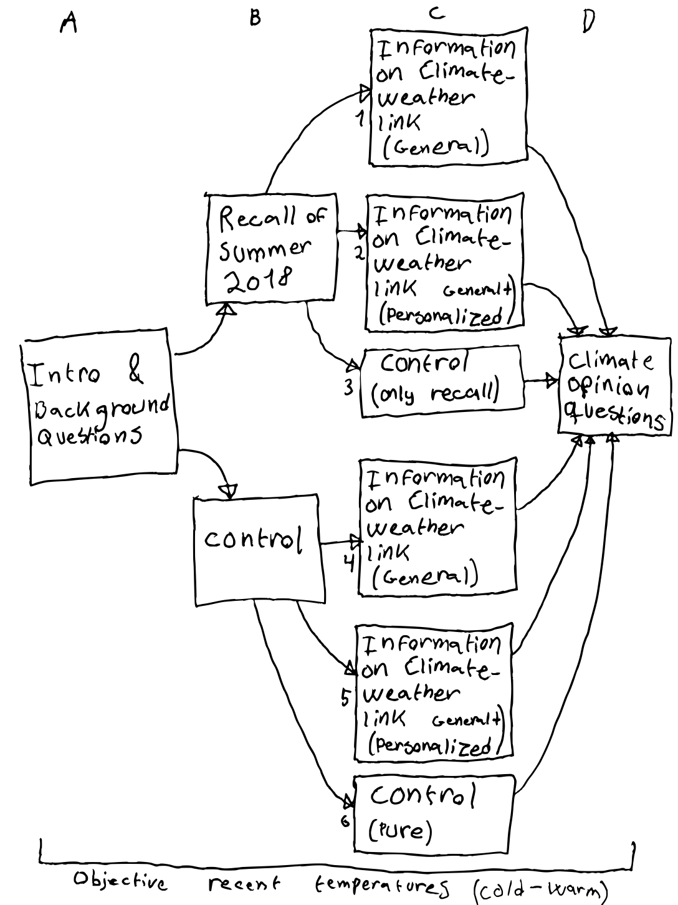

```{r, include = FALSE}

pacman::p_load(tidyverse, 
               knitr, 
               lubridate, 
               kableExtra,
               xaringan,
               xaringanExtra)

knitr::opts_chunk$set(echo = FALSE, 
                      fig.align = "center", 
                      cache = TRUE,
                      out.width="1000px"
                      )

Sys.setlocale(locale = "da_DK.UTF-8")

xaringanExtra::use_tile_view()

```

# Background

- My **project**: How personal experience with extreme/unusual weather shapes climate opinions and behavior

--

- For instance, **exposure to unusual recent temperatures or a flooding event** can increase climate awareness/concern (sometimes also opinions and behavior)

--

- But why? It must depend on what (other) information/knowledge they have about **the climate-weather link**. Why else relevant?

--

- Key project hypothesis: **Media climate coverage or other provision of information on climate-weather link strengthens effects of weather experiences**

--

- Long story short: **Hard to do causal study** of experience-knowledge interaction &rarr; but with this study we directly attempt it (for the first time)  

---

# This study

.pull-left[

<br>
- Is a subproject with Tobias Heide-Jørgensen

- To assess if **information (knowledge) about climate-weather link strengthens effects of experience**, we do a:

]

.pull-right[
```{r beach, out.width="350px", fig.align='right'}
include_graphics("media/20180719_163331_red2.png")
```
]

--

- **Survey experiment** with 30 questions, 2500 respondents, and 6 experimental groups  

--

- We also want to address (1) the **direct effect of personal weather experiences** and (2) of **information** plus (3) whether **priming self-interest** considerations is necessary/effective,  as well as (4) **how effects vary** among groups (e.g., based on ideology, political awareness, environmentalists/the rest)

--

- **Case: Heatwaves, high temperatures, and extreme summer of 2018** (with heatwaves, record-breaking sun, heat, and drought, burn ban, etc.)

---

# This study 

**Four treatments** 

--

1. Prompt and subtle "aid" to **recall 2018 summer weather**
2. **Information** about climate change causing more extreme weather
3. Same as 3. plus the information that it may have serious personal **health-related consequences** (to prime self-interest) 
4. Objective local, recent outdoor **temperatures** (observed)

--

**Four outcomes**

1. Climate **awareness** (index)
2. Climate **opinions** (index)
3. **Willingness-to-act** (single measure)
4. **Willingness-to-pay** (single measure)

---

# Theoretical framing and contribution

<br>

- Design is almost settled, but theoretical framing is not, so

--

- **How do we think about and frame this interaction between information and personal experience?**

--

- Information about the climate-weather link makes personal experience **relevant**, it **activates** it as a **source of information** or as a **useful heuristic**

--

- We are considering framing it with Hopkins (2010), modified:<br>**Climate-weather information _politicizes_ local weather experiences**

***

--

- We contribute to:

  - (Climate) **opinion formation** and political behavior literature including information processing and role of experience and self-interest       
  - Climate change **communication**

---
class: title, center, middle

# Thank you!

---

# Survey design sketch

```{r design, out.width="425px"}

```