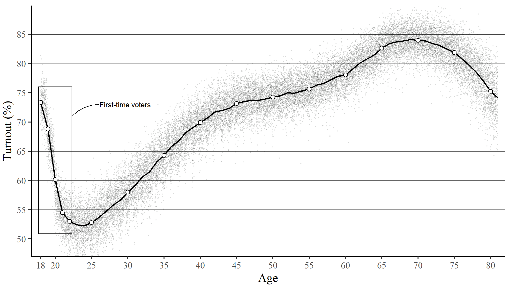
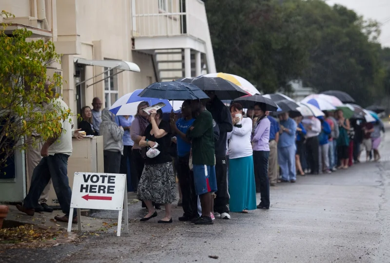
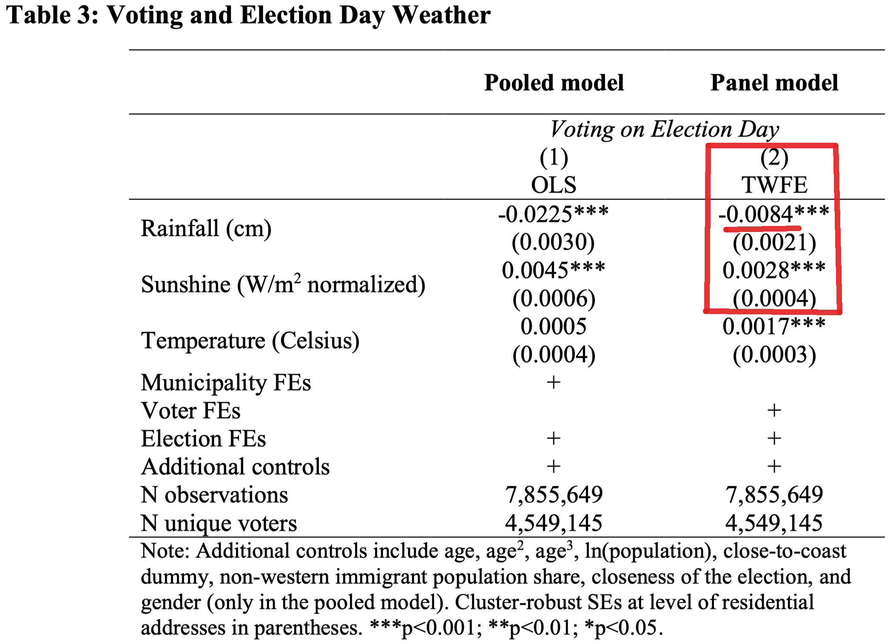

```{r, include=F}

pacman::p_load(tidyverse, 
               knitr, 
               lubridate, 
               kableExtra,
               xaringan,
               xaringanExtra)

knitr::opts_chunk$set(echo = FALSE, 
                      fig.align = "center", 
                      cache = TRUE,
                      out.width="1000px"
                      )

Sys.setlocale(locale = "da_DK.UTF-8")

xaringanExtra::use_tile_view()

```

# Turnout and weather

<br>**RQ: Does bad weather on Election Day cause voters to stay home and not turn out for election?**<br>

--
<br>
> "It's __a myth that the weather matters for turnout__. If the weather is bad, maybe a few voters stay home. But today's weather is probably of little importance.".right[*Jørgen Elklit, Ritzau, 2005 (translated)*]

--
<br>
> "There are lots of things that affect turnout, but the weather does not seem to be one of them. In the Danish context, we have tried and tried to show that when it rains, people will stay at home. But __the Danes turn out no matter if it rains__ or snows".right[*Kasper M. Hansen, DR Nyheder, 2015 (translated)*]

---

# Why is this important?

--
<br>
- Frequent references in the media in Denmark and other countries &rarr; calls for systematic analysis

--

- Electoral turnout is a key indicator of health and legitimacy of democracy 

--

- Small weather effects are not necessarily important per se if they affect all citizens the same<br>&rarr; small overall reduction in turnout

--

- (However, global climate change will make extreme and unpleasant Election day weather more likely, so it should not be dismissed completely)

--

- Much more important: If **marginal voter groups** are more susceptible to bad weather in their decision to go voting, the weather can induce inequalities in the democratic representation   

---

# Contribution

--

- We show that existing research is highly mixed in terms of design and results

--

- We provide better evidence to the matter through several __methodological advantages__:

  - Validated individual-level data (handful of previous studies) 
  
  - (Almost) complete electorate (first study)
  
  - Panel data with repeated measurements (first study)

--

## Key results

- Rainfall ("**bad weather**") reduces probability of voting (1.1 pp per cm rain) 

--

- Sunshine ("**nice weather**") increases it

--

- The rainfall effect grows with rainfall levels (i.e., is **not linear**)
  
--

- **Young (marginal) voters** are roughly five times more susceptible to weather effects

---

# Theoretical background
<br>
- **Cost of voting**

--

- Potential __mood__ effects

--

- __Meta-analysis__ of 30 studies: Mixed results from heterogeneous designs

--

- Average effect of __rainfall__: -0.76 percentage points per cm of rain

---

# Marginal voters
<br>
- If the weather disproportionately reduces turnout in marginal voter groups, it can be a major issue for democratic representation

--

- __Marginal voters__ are "*those whose decisions to turn out are sensitive to exogenous factors*" (Fowler 2015: 205)

--

- We focus on **young voters** in their (early) twenties who generally have (1) left their childhood home and (2) not yet established a solid voting habit

???

Fowler, A. (2015) Regular voters, marginal voters and the election effects of turnout. *The European Political Science Association* 3(2): 205-219.

---

# Marginal voters

```{r turnout, fig.cap = "The rollercoaster ride of turnout and age", out.width='80%'}

```

???

The figure shows descriptive turnout rates by voter age on Election Day binned in years (18-80) and pooled across the 2013 and 2017 elections. N=7,855,649.

---

# Data
<br>
- Validated __voter records__ for all* eligible Danish voters at municipal elections of 2013 and 2017

.footnote[*Excluding ~1% and ~9% in non-participating municipalities, ~3% early voting, and elderly voters above age 80.]

--

- __4,459,145 eligible in-person voters__ (age 18-80) &rarr; ~73% eligible at both elections

--

- Home coordinates &rarr; __individual weather exposure__ from validated DMI data

---

# Individual weather exposure from DMI weather stations

```{r stations}
include_graphics("media/weather-stations.png")
```

---

# Estimation
<br>
- __OLS regression__ of in-person turnout (1/0) on (Election Day) rainfall, sunshine, and temperature

--

- Two strategies: 

  - (1) **pooled model**: Municipality and election fixed effects assuming as-if randomness of weather exposure

--
  
  - (2) **panel model**: Municipality, election, and __voter__ fixed effects eliminating bias from invariant factors

--

- Additional __controls__: (individual) age, gender, (municipal) population size, share of non-Western immigrants, and closeness of the election

---

# Results

- **Rainfall** *does* decrease probability of voting (turnout)

--

- Our best estimate is __-1.1 pp per cm__ of rainfall (avg. in literature: -0.76 pp per cm)

--

- Rainfall effect is __non-linear__: Increases with rainfall level

--

- __Sunshine__ boosts turnout (mixed results for temperature)

--

- Very strong weather effects on **marginal voters**, i.e., young voters in their twenties __&rarr;__ 

--

```{r interaction, out.height='65%', out.width='65%'}
include_graphics("media/interaction_age3_panel.png")
```


---
class: center, middle

# Thank you for your attention!
<br>
```{r pic, out.width='50%'}

```
<span style="color:grey;font-size:9pt;">Edward Linsmier—Getty Images 2014, time.com/3554884/2014-election-weather-forecast</span>


---

# Appendix

```{r regtable, out.width='65%'}

```

---

# Appendix

```{r nonlin}
include_graphics("media/curvelinear_marginal-effects_panel.png")
```

---

# Appendix

```{r interaction_large}
include_graphics("media/interaction_age3_panel.png")
```

---

# Appendix

```{r interaction_large_pool}
include_graphics("media/interaction_age3_pool.png")
```
