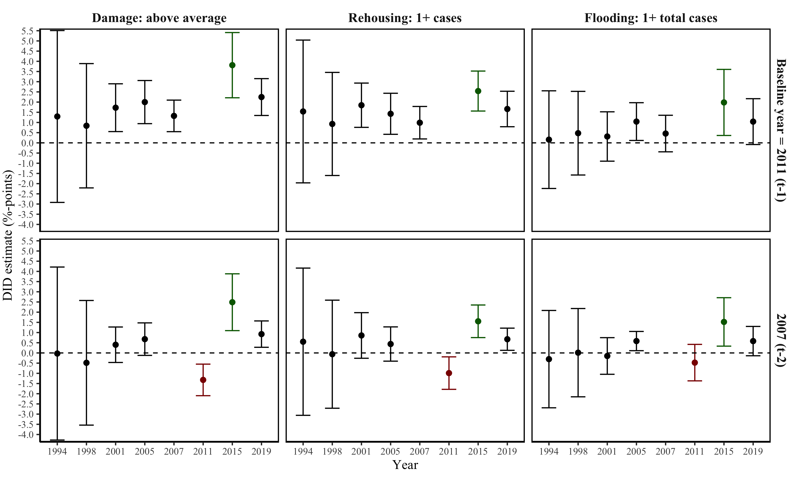

```{r, include = FALSE}
pacman::p_load(tidyverse, 
               knitr, 
               lubridate, 
               kableExtra,
               xaringan,
               xaringanExtra)

knitr::opts_chunk$set(echo = FALSE, 
                      fig.align = "center", 
                      cache = TRUE,
                      out.height="95%"
)

Sys.setlocale(locale = "da_DK.UTF-8")

xaringanExtra::use_tile_view()
xaringanExtra::use_panelset()
```

```{r xaringan-themer, include=FALSE, warning=FALSE}
library(xaringanthemer)

style_mono_accent(
  # Colors
  base_color = "#8b2325",
  text_color = "#000000", 
  link_color = "#808080", 
  text_bold_color = "#8b2325",
  title_slide_background_color = "#8b2325",
  title_slide_text_color = "#FFFFFF",
  colors = c("white" = "#FFFFFF", "black" = "#000000", "grey" = "#808080", "kingblue" = "#0D0668", "lightgrey" = "#CDCEC6"),
  # Fonts
  text_bold_font_weight = "normal",
  text_font_base = "sans-serif",
  text_font_google = google_font("Metrophobic"),
  code_font_google = google_font("Metrophobic"),
  header_font_google = google_font("Metrophobic"),
  base_font_size = "16pt",
  text_font_size = "16pt",
  code_font_size = "16pt",
  code_inline_font_size = "16pt",
  header_h1_font_size = "30pt",
  header_h2_font_size = "20pt",
  header_h3_font_size = "20pt")

# Ekstra
style_extra_css(
  css = list(
    ".left-column" = list("width" = "33%",
                          "height" = "95%",
                          "float" = "left"),
    ".right-column" = list("width" = "65%",
                           "height" = "95%",
                           #"padding-left" = "1em",
                           "float" = "right")))
```

background-image: url(media/bodil.png)
background-size: cover

.right[.grey[Image by Jeanne and John Bollerup-Jensen]]

---
```{r}
include_graphics("media/flooding_map_total.png")
```

---
```{r}
include_graphics("media/parallel_trends_plot_main.png")
```

---
```{r}
include_graphics("media/balance_density.png")
```

---
```{r}

```

---
```{r}
include_graphics("media/did_estimates_2x2.png")
```

---
```{r}

```

---
```{r}

```

---
```{r}
include_graphics("media/did_estimates_2x2_candidates.png")
```