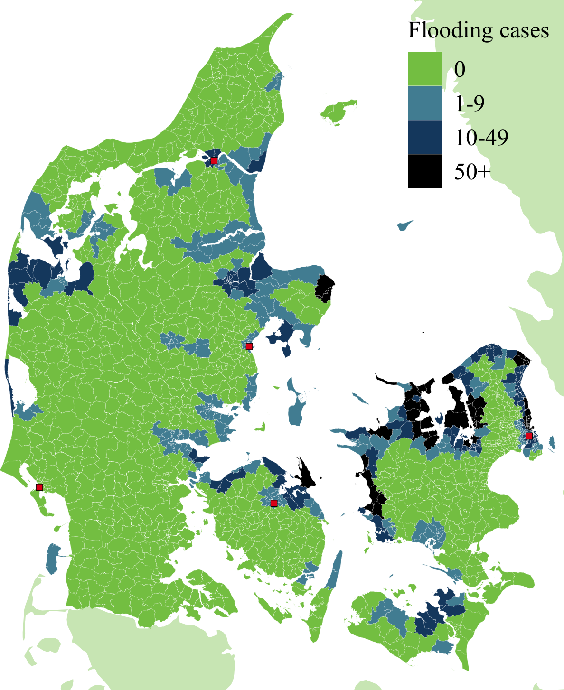
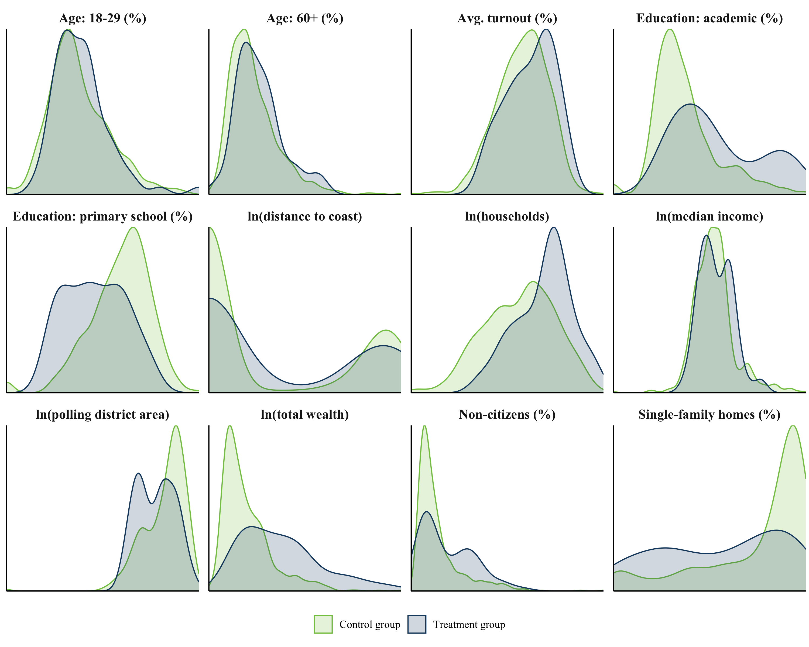

```{r, include = FALSE}
pacman::p_load(tidyverse, 
               knitr, 
               lubridate, 
               kableExtra,
               xaringan,
               xaringanExtra,
               namedropR)

# bib_path <- "/Users/soren/Work/Papers/flooding-pplaces/references.bib"

knitr::opts_chunk$set(echo = FALSE, 
                      fig.align = "center", 
                      cache = TRUE
)

Sys.setlocale(locale = "da_DK.UTF-8")

xaringanExtra::use_tile_view()
xaringanExtra::use_panelset()
```

```{r xaringan-themer, include=FALSE, warning=FALSE}
library(xaringanthemer)

style_mono_accent(
  # Colors
  base_color = "#8b2325",
  text_color = "#000000", 
  link_color = "#808080", 
  text_bold_color = "#8b2325",
  title_slide_background_color = "#8b2325",
  title_slide_text_color = "#FFFFFF",
  colors = c("white" = "#FFFFFF", "black" = "#000000", "grey" = "#808080", "kingblue" = "#0D0668", "lightgrey" = "#CDCEC6"),
  # Fonts
  text_bold_font_weight = "normal",
  text_font_base = "sans-serif",
  text_font_google = google_font("Metrophobic"),
  code_font_google = google_font("Metrophobic"),
  header_font_google = google_font("Metrophobic"),
  base_font_size = "16pt",
  text_font_size = "16pt",
  code_font_size = "16pt",
  code_inline_font_size = "16pt",
  header_h1_font_size = "30pt",
  header_h2_font_size = "18pt",
  header_h3_font_size = "16pt")

# Ekstra
style_extra_css(
  css = list(
    ".left-column" = list("width" = "33%",
                          "height" = "95%",
                          "float" = "left"),
    ".right-column" = list("width" = "65%",
                           "height" = "95%",
                           #"padding-left" = "1em",
                           "float" = "right")))
```

background-image: url(media/bodil.png)
background-size: cover

.right[.grey[Image by Jeanne and John Bollerup-Jensen]]

---
class: middle

```{r, out.width="70%"}

```

---

# A rarely harmful extreme weather event in Denmark

- 2013 __storm surge__ after 'Bodil' 

--

- Detailed, case-level **storm surge insurance data** (Danish Storm Council)

--

- Flooding measured at the level of __1,386 polling districts__

--

- 3 treatment definitions (dummies):

    1. **Rehousing:** 1+ cases of rehoused residents   
    2. **Damage:** storm surge damage (DKK) above avg. in affected areas
    3. **Flooding:** 1+ storm surge cases

--

- Matched with **main outcome:** _district vote share for pro-climate parties_ (1994-2019)

--

- Difference-in-differences (DID) design

--

***

> __RQ: How does an extreme, costly flood event affect electoral support for pro-climate parties and candidates?__

---

# Theory

- Ample evidence that __extreme weather experiences can affect climate change perceptions and attitudes__

--

- But limited evidence that weather experiences affect __actual behavior__ &mdash; environmental or political

--

- Several studies exist, but they are framed in a different way &darr;

--

    - __natural disasters__ &rarr; __electoral behavior__
    
    - __retrospective voting:__ rewarding or punishing incumbents based on how they handled the event
    
    - still mixed results: sometimes punishment, sometimes reward
    
--
    
- What if it's more about **policy:** 

    - voters updating preferences on climate adaptation and mitigation<br>(and/or parties and candidates adopting pro-climate policies to attract voters)

    - some evidence: e.g., "a sizeable effect for pro-climate voting after experiencing a flood" (Baccini & Leemann, 2021)
    
???

Baccini, L., & Leemann, L. (2021). Do natural disasters help the environment? How voters respond and what that means. Political Science Research and Methods, 9(3), 468–484. https://doi.org/10.1017/psrm.2020.25

---

# Parallel trends: outcome evolution

```{r, out.width="90%"}
include_graphics("media/parallel_trends_plot_main.png")
```

???

```{r}
include_graphics("media/parallel_trends_plot_all.png")
```

---

# Parallel trends: pre-treatment balance

```{r, out.width="50%"}

```

---

# Results: DID estimates

```{r}
include_graphics("media/did_estimates_2x2.png")
```

???

```{r}
include_graphics("media/did_estimates_intensity.png")
```

---

# Results: event study plots (placebo)

```{r, out.width="85%"}
include_graphics("media/did_estimates_eventstudy.png")
```

---
class: middle

# Part II: support for pro-climate candidates

---

# Part II: candidate data from 2017 local elections

--

*Key variables:*

- (1) *Outcome:* **being elected (binary)** in 2017, 2013 (and 2009)

--

- (2) Running in a **treated municipality (binary)** w/ 10+ rehousing cases

--

- (3) Running on a **pro-climate platform (binary)** w/ climate as key issue or high climate score

***

--

> __RQ: Are pro-climate candidates rewarded more (punished less) by flooding in affected areas?__

--

_Triple differences (DIDID):_<br>

.center[&rarr; we should expect **a positive difference in DID estimates** for pro-climate vs. non-climate candidates]

---

# Results: DIDID estimate

```{r, out.width="75%"}
include_graphics("media/did_estimates_2x2_candidates_table.png")
```

---

# Results: DIDID estimate

<br>

.pull-left[
```{r, out.width="75%"}
include_graphics("media/did_estimates_2x2_candidates_table.png")
```
]

.pull-right[
- &rarr; approx. 6 percentage points difference (DIDID)

- pro-climate candidates benefit in post-flooding elections

- not yet clear if the voters change preferences or candidates change policy
]

---

# Results: DIDID placebo

```{r, out.width="90%"}
include_graphics("media/did_estimates_2x2_candidates.png")
```

---

# Conclusion

> __RQ: How does an extreme, costly flood event affect electoral support for pro-climate parties and candidates?__

--

- __Case:__ Denmark, 2013 storm surge 'Bodil' and surrounding elections

--

- __Data:__ Detailed flooding damages and vote shares for parties and candidates

--

- __DID design__

--

- __Results:__

    - Pro-climate (left-green) parties gain at least 1.5 pp
    
    - Pro-climate candidates see their election chances increase by 6 pp vs. non-climate candidates

--
<br><br>
Still plenty of black boxes and additional analysis and interpretation to do ... 

---
class: title-slide, middle, center

# Thank you!

&rarr; sdas@ifs.ku.dk

```{r, out.width="45%"}
include_graphics("media/banksy.jpg")
```

.grey[Banksy (image by Zak Hussein<br>/ PA Images via Getty Images)]