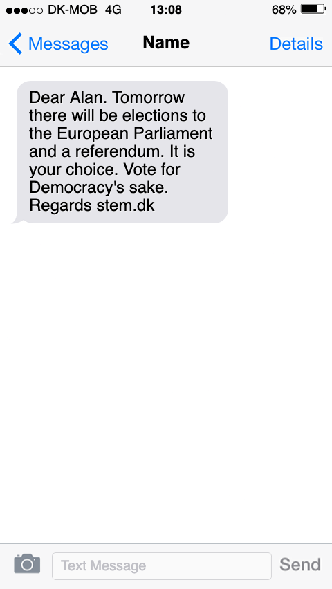
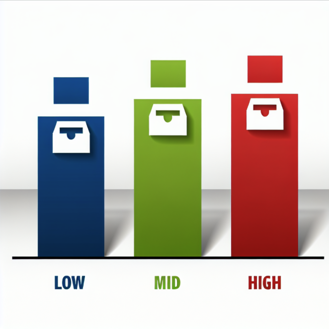

```{r}
#| include: false
pacman::p_load(tidyverse, knitr, lubridate, kableExtra)
sysfonts::font_add_google("Alegreya Sans", "Alegreya Sans", regular.wt = 300)
showtext::showtext_auto()
```

## Motivation

<br>

- Can GOTV efforts increase turnout and also **improve participatory equality?**
- Unclear what the **downstream (long-term) effects** are of GOTV campaigns
    - requires large field experiments in the past
    - highly demanding downstream data requirements
    - some evidence of long-term effects,<br>primarily through **habit** (Coppock & Green 2016)

## Motivation

<br>

- The (immediate) effects of GOTV campaigns have been shown to be moderated by baseline **voting propensity**
    - (e.g., Bhatti et al. 2018; Enos et al. 2014; Hirvonen et al. 2025)
    - Ongoing debate!
    - Key disagreement: 
        - mostly **low-mid (Europe)** or mostly **high (US)**
        - *high* exacerbates inequality
- None have studied **long-term effects on participatory inequality** (low, mid, high)
- We analyze conditional long-term effects of two large Danish GOTV field experiments

## Data and design

- Two **GOTV field experiments** targeting *young* voters (18-29 years)
    - 2013 n = 95,570 voters
    - 2014 n = 153,661 voters
    - total n = 249,231 voters
    - sampled randomly from among vast majority of young electorate
- Combined with all available **downstream turnout records**
    - 8 downstream elections
        - 2014-2024
        - local, national, EU
    - 2013 total n = 710,386 turnout decisions 
    - 2014 total n = 1,152,522 turnout decisions
    
## Data and design

- **Panel attrition** in downstream elections
    - 4-44 % 
    - causes: 
        - death and migration (rare)
        - non-eligibility (more common)
        - lack of turnout data from entire municipalities<br>(common in two elections: 2014-2015)
    - no influence across elections
    - virtually **no self-selection**
    - results quite robust to use of restricted/balanced panels

## Data and design

:::: {.columns}
::: {.column width="50%"}
- **Treatment**
    - SMS text message sent out 0-6 days before Election Day
    - **Short reminder** about upcoming election + frame/tone variations
- **Outcome** 
    - binary **turnout**
    - individual, validated, administrative
    - basis of *actual election results*
:::
::: {.column width="10%"}
:::
::: {.column width="40%"}
```{r}

```


:::
::::

## Data and design

:::: {.columns}
::: {.column width="70%"}
- **Moderator:** baseline voting propensity
    - *low*, *mid*, *high* (~equal-sized)
    - based on **predicting turnout** in control group
    - logit model with **predictors:** admin **sociodemographics** (e.g., age, gender, social status, income, education, origin country), past **turnout**, same for **parents**
- **Analysis: OLS regression**
    - **total effects:** (essentially) *difference-in-means* &rarr; ITTs
        - election FEs, marginalizing over election
    - **conditional effects:** *interaction* between treatment and voting propensity
        - election FEs, marginalizing over election + voting propensity
:::
::: {.column width="3%"}
:::
::: {.column width="27%"}
```{r}

```
:::
::::

    

        
# Results {background-color="#026B81"}

## Effects of 2013 text message GOTV campaign

. . .

:::: {.columns}
::: {.column width="58%"}
```{r}
#| crop: true
knitr::knit_hooks$set(crop = knitr::hook_pdfcrop)
knitr::include_graphics(c("media/direct_20250613_new_2013.png", "media/direct_20250613_new_legend.png"))
```
:::
::: {.column width="0%"}
:::
::: {.column width="42%"}

1. Strong **immediate effects**, especially on low-propensity voters
2. Different picture for **downstream effects**:
    - **low:** no downstream effects
    - **mid:** strong downstream effects across five elections
    - **high:** downstream effects in next local election
    - **total:** positive downstream effects in 3+ elections
3. Cumulative effect = **increasing participatory inequality?**

:::
::::


## (Limited) effects of 2014 text message GOTV campaign

. . .

:::: {.columns}
::: {.column width="58%"}
```{r}
#| crop: true
knitr::knit_hooks$set(crop = knitr::hook_pdfcrop)
knitr::include_graphics(c("media/direct_20250613_new_2014.png", "media/direct_20250613_new_legend.png"))
```
:::
::: {.column width="0%"}
:::
::: {.column width="42%"}

1. No evidence of downstream effects
2. Strong **immediate effects** only for low-propensity voters
3. Two findings replicate:
    a. "stairway" of immediate effects
    b. no downstream effect for low
4. Treatments possibly too weak, on average
    - evidence of *total* downstream effect for particular **timing-tone** treatment combos
    - possibly similar downstream effects conditional on voting propensity

:::
::::

# Conclusions {background-color="#026B81"}

- Studies of GOTV **downstream effects** are rare
- Studies of GOTV effects conditional on **voting propensity** are few
- Combination can tell us a lot about long-term benefits/risks to **participatory (in)equality**
- We show evidence on a decade of GOTV impact on low, mid, and high propensity voters
    - immediate effects strong(est) for **low-propensity voters**
    - but **no downstream** effects!
    - multiple downstream effects on **mid-high propensity voters**
    - likely, **not improving equality** long term -- and may harm it
- Questions: (a) mechanism, (b) case + propensity definition, (c) cumulative effect


# Thank you {background-color="#026B81"}