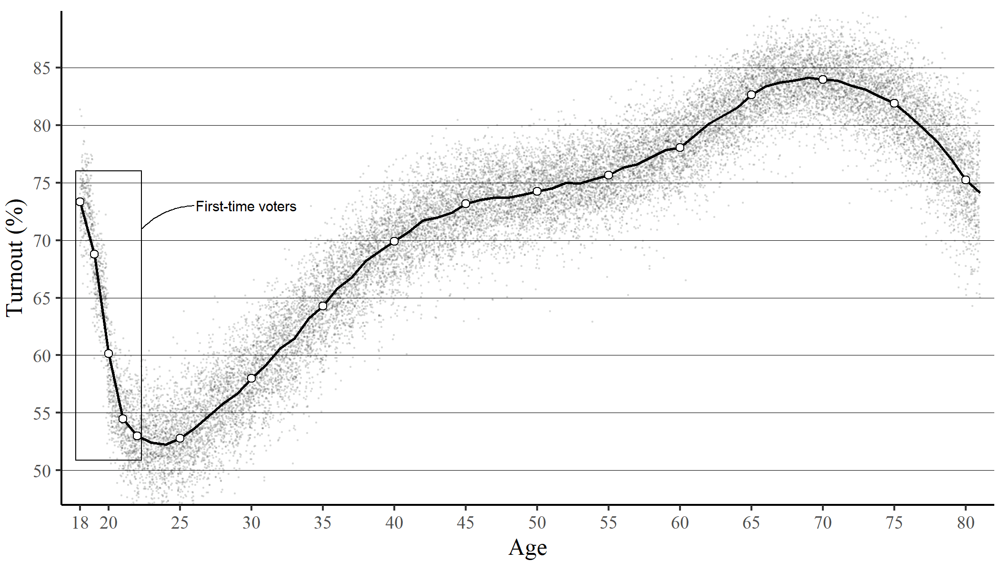
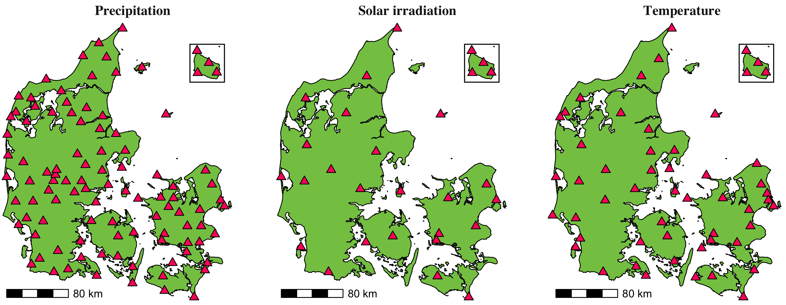
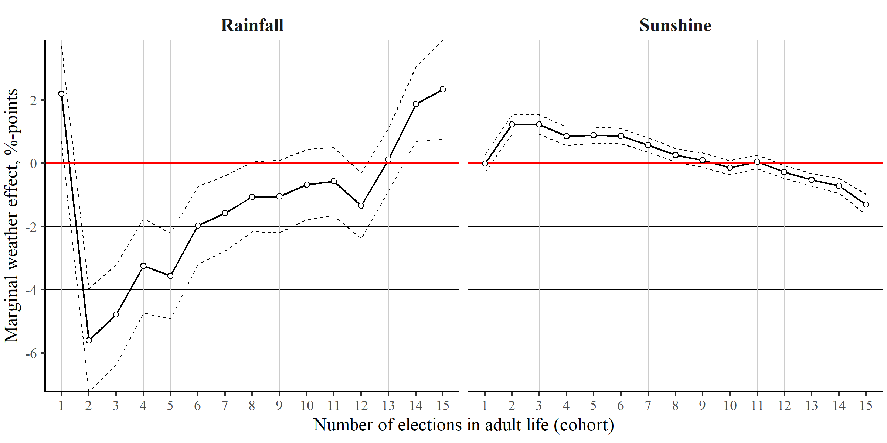
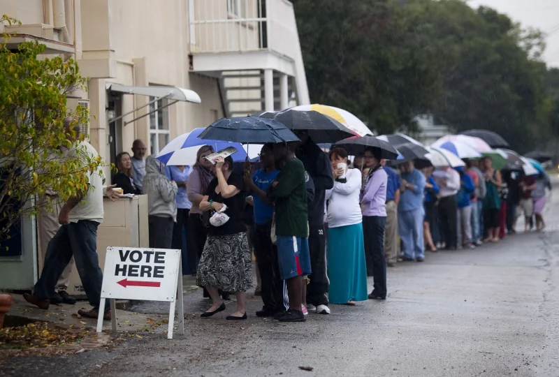
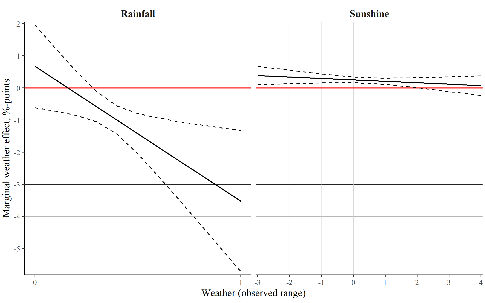
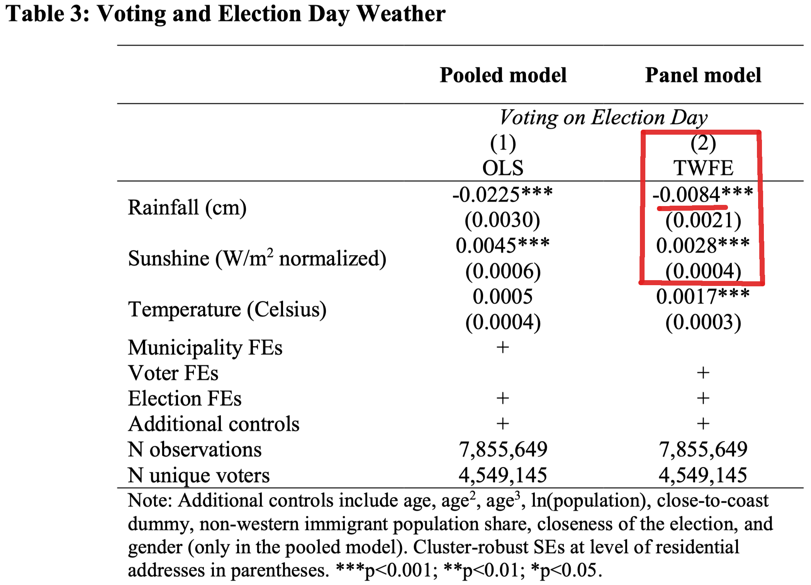

```{r, include = FALSE}
pacman::p_load(tidyverse, 
               knitr, 
               lubridate, 
               kableExtra,
               xaringan,
               xaringanExtra)

knitr::opts_chunk$set(echo = FALSE, 
                      fig.align = "center", 
                      cache = TRUE,
                      out.width="1000px"
)

Sys.setlocale(locale = "da_DK.UTF-8")

xaringanExtra::use_tile_view()
```

```{r xaringan-themer, include=FALSE, warning=FALSE}
library(xaringanthemer)

style_mono_accent(
  # Colors
  base_color = "#8b2325",
  text_color = "#000000", 
  link_color = "#808080", 
  text_bold_color = "#8b2325",
  title_slide_background_color = "#8b2325",
  title_slide_text_color = "#FFFFFF",
  colors = c("white" = "#FFFFFF", "black" = "#000000"),
  # Fonts
  text_bold_font_weight = "normal",
  text_font_base = "sans-serif",
  text_font_google = google_font("Metrophobic"),
  code_font_google = google_font("Metrophobic"),
  header_font_google = google_font("Metrophobic"),
  base_font_size = "16pt",
  text_font_size = "16pt",
  code_font_size = "16pt",
  code_inline_font_size = "16pt",
  header_h1_font_size = "30pt",
  header_h2_font_size = "20pt",
  header_h3_font_size = "16pt"
)
```

# Turnout and weather

<br>**RQ: Does bad weather on Election Day cause voters to stay home and not turn out for election?**<br>

--
<br>
- Frequent references in the **media**

--

- Electoral turnout is a key __indicator of health and legitimacy__ of democracy 

--

- Small weather effects are not necessarily important *per se*
  - if they affect all citizens the same
  - &rarr; small overall reduction in turnout

--

- (However, global **climate change** will make unpleasant Election day weather more likely, so it should not be dismissed)

--

- Much more important: If **marginal voter groups** are more susceptible, the weather can induce **inequalities** in  democratic representation   

---

# Contribution

--

- We show that **existing research is highly mixed** in terms of design and results

--

- We provide better evidence to the matter through several __methodological advantages__

--

  - Validated **individual-level data** [handful of previous studies]
  
  - (Almost) **complete electorate** (with huge N) [first study]
  
  - **Panel data** with repeated measurements [first study]

--

## Key results

- Rainfall ("**bad weather**") reduces probability of voting (0.84 pp per cm rain) 

--

- Sunshine ("**nice weather**") increases it
  
--

- **Young (marginal) voters** are roughly five times more susceptible to weather effects

---

# Theoretical background
<br>
- **Cost of voting**

--

- Also potential __mood__ effects

--

- __Meta-analysis__ of 30 studies: Average effect -0.76 percentage points per cm of rainfall

---

# Marginal voters

- "*those whose decisions to turn out are sensitive to exogenous factors*" (Fowler 2015: 205)

--

- If the weather disproportionately reduces turnout in marginal voter groups, it **can be a major issue** for democratic representation

--

- We focus on **young voters** in their (early) twenties who have (1) left their childhood home and (2) not yet established a solid voting habit

--

.pull-left[
```{r turnout}

```
]
.pull-right[
<br><br><br>
.center['The rollercoaster ride of turnout and age' (descriptive turnout by age at KV13-KV17)]
]

???

Fowler, A. (2015) Regular voters, marginal voters and the election effects of turnout. *The European Political Science Association* 3(2): 205-219.

The figure shows descriptive turnout rates by voter age on Election Day binned in years (18-80) and pooled across the 2013 and 2017 elections. N=7,855,649.

---

# Data

- Validated __voter records__ for all* eligible Danish voters at municipal elections of 2013 and 2017

.footnote[*Excluding ~1% and ~9% in non-participating municipalities, ~3% early voting, and elderly voters above age 80.]

--

- 4,459,145 eligible __in-person voters__ (age 18-80)

--

- Home coordinates &rarr; __individual weather exposure__ from validated DMI data __&darr;__

???

~73% eligible at both elections

---

# Data

- Validated __voter records__ for all* eligible Danish voters at municipal elections of 2013 and 2017

- 4,459,145 eligible __in-person voters__ (age 18-80)

- Home coordinates &rarr; __individual weather exposure__ from validated DMI data __&darr;__

```{r stations, fig.cap='Individual weather exposure from 166 DMI weather stations'}

```

???

~73% eligible at both elections

---

# Estimation
<br>
- __OLS regression__ of turnout (1/0) on rainfall, sunshine, and temperature with FEs

--

- Two strategies: 

  - (1) **pooled model**: Municipality and election fixed effects

--
  
  - (2) **panel model**: __Voter__ and election fixed effects

--

- Additional __controls__: (individual) age, gender, close to coast, (municipal) population size, share of non-Western immigrants, and closeness of the election

---

# Results

- **Rainfall** *does* decrease probability of voting (i.e., turnout)

--

- Our best estimate is __-0.84 pp per cm of rainfall__ (avg: -0.76 pp per cm)

--

- The rainfall effect grows with rainfall levels (i.e., is **non-linear**)

--

- __Sunshine__ boosts turnout

--

- Very strong weather effects on __young (marginal) voters &darr;__ 

```{r interaction, out.height='65%', out.width='65%'}

```

---
class: center, middle

# Thank you for your attention!
<br>
```{r pic, out.width='50%'}

```
<span style="color:grey;font-size:9pt;">Edward Linsmier—Getty Images 2014, time.com/3554884/2014-election-weather-forecast</span>

---
class: center, middle

---

```{r interaction_large_pool}

```

---

```{r nonlin}

```

---

```{r regtable, out.width='65%'}

```