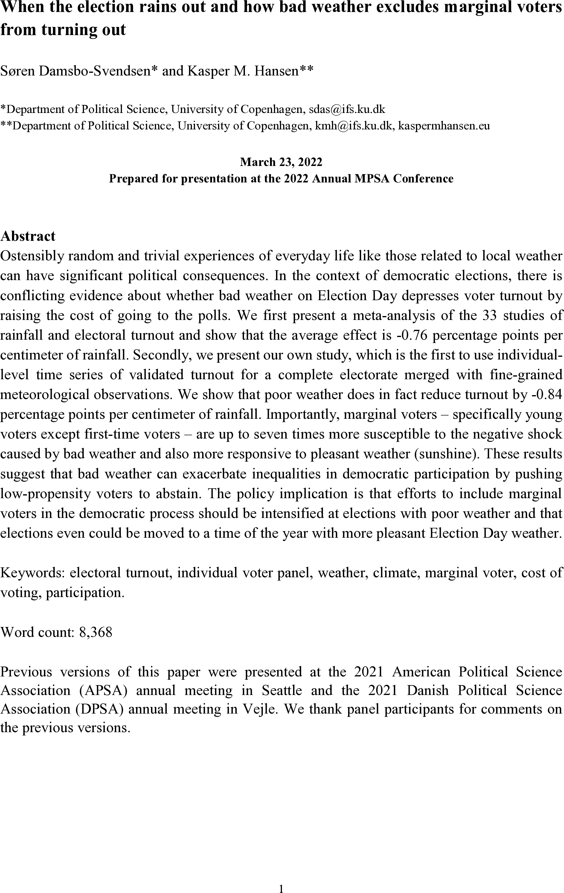
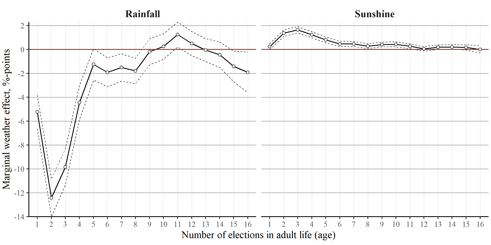

```{r, include = FALSE}
pacman::p_load(tidyverse, 
               knitr, 
               lubridate, 
               kableExtra,
               xaringan,
               xaringanExtra)

knitr::opts_chunk$set(echo = FALSE, 
                      fig.align = "center", 
                      cache = TRUE,
                      out.width="1000px"
)

Sys.setlocale(locale = "da_DK.UTF-8")

xaringanExtra::use_tile_view()
```

```{r xaringan-themer, include=FALSE, warning=FALSE}
library(xaringanthemer)

style_mono_accent(
  # Colors
  base_color = "#8b2325",
  text_color = "#000000", 
  link_color = "#808080", 
  text_bold_color = "#8b2325",
  title_slide_background_color = "#8b2325",
  title_slide_text_color = "#FFFFFF",
  colors = c("white" = "#FFFFFF", "black" = "#000000"),
  # Fonts
  text_bold_font_weight = "normal",
  text_font_base = "sans-serif",
  text_font_google = google_font("Metrophobic"),
  code_font_google = google_font("Metrophobic"),
  header_font_google = google_font("Metrophobic"),
  base_font_size = "16pt",
  text_font_size = "16pt",
  code_font_size = "16pt",
  code_inline_font_size = "16pt",
  header_h1_font_size = "30pt",
  header_h2_font_size = "20pt",
  header_h3_font_size = "16pt"
)
```

layout: true

<br><br>

.pull-left[
<br>
```{r, out.width="55%"}

```
]

---

.pull-right[<br>
**RQ: How does Election Day weather affect voters' decision to turn out for election &mdash; and for whom?**<br>

- Electoral turnout is a key __indicator of health and legitimacy__ of democracy 

- Focus on rainfall: does it reduce turnout?

- *Mechanism:* **Cost of voting** and possibly __mood__
]

---

.pull-right[<br>
First, we did a **meta-analysis:** 

- Rainfall effect

- 33 studies

- Mixed designs and results

- (But) avg. rainfall effect:<br>**-0.76 %-points per cm**
]

---

.pull-right[<br>
New **stand-alone study** with great data:

1. Revisit rainfall-turnout thesis
  
2. Explore **other weather** variables
  
3. **Nonlinear** weather effects

4. **Heterogeneous** weather effects
]  

---
layout: false

# Data: turnout records

Individual turnout records for 4,549,145* Danish voters age 18-80

--

- **Validated** registry data
    - &rarr; high quality 
    - [handful of previous studies]

--

- (Almost) **complete electorate** 
    - &rarr; huge N 
    - [first study]

--

- **Repeated measurements** at 2013 and 2017 local elections 
    - &rarr; voter panel 
    - [first study]

???

- Missing data on ~1% (2013) and ~9% (2017) of eligible voters because of non-participating municipalities. 

- Exclusion of ~3% early voting and voters above age 80

---

# Data: objective weather observations

```{r stations}
include_graphics("media/weather-stations.png")
```

- Voters' home coordinates matched with **166 weather stations**

- __Individual weather__ *triangulated* from three nearest weather stations

---

# Design and models

.pull-left[
**(1) Pooled model** 

- Regression of turnout on *rainfall*, *sunshine*, *temperature* with municipality and election FEs

    - cross-sectional variation
    
    - assumption of (conditional) as-if randomness in assignment of weather 
]

--

.pull-right[
**(2) Panel model** 

- Regression of turnout on *rainfall*, *sunshine*, *temperature* with voter and election FEs (TWFE)

    - within-unit variation over time
    
    - assumption of no selection into treatment from *time-varying* individual-level factors that shape where one lives<br>(i.e., local weather)
    
    - stronger basis for causal inference,<br>first in the literature
]

???

- __Additional controls:__ (individual) age, gender, living close to coast, municipal population size, share of non-Western immigrants, and closeness of the election

---
class: title-slide, center, middle

# Results

---
class: middle

## Result I: Negative rainfall effect

- **Rainfall** &mdash; "bad weather" &mdash; reduces probability of voting

- **-0.84 %-points** per centimeter rain, on average

- Substantial difference between panel model &uarr; and pooled model

---
class: middle

## Result II: Positive sunshine effect

- __Sunshine__ &mdash; "nice weather" &mdash; also boosts turnout

- **1.52 %-points** diff. between max and min observed sunshine

---
class: middle

## Result III: Nonlinear rainfall effect

.left-column[

<br><br>

- **Rainfall effect** increases with more rain

- No effect at zero rain, approx. **-3.5 %-points** at max 

- (Sunshine effect is not nonlinear)
]

.right-column[
```{r}
include_graphics("media/nonlinear_panel.png")
```
]

---
class: middle

## Result IV: Stronger effects on marginal voters

- Important Q &rarr; **Are marginal voter groups more susceptible?**

- **Potentially major issue** for democratic representation

- We focus on **young voters** in their twenties who have
    - left their childhood home 
    - not yet established a solid voting habit

???

Marginal voters: "*those whose decisions to turn out are sensitive to exogenous factors*" (Fowler 2015: 205)

```{r turnout, fig.cap="'The rollercoaster ride of turnout and age' (descriptive turnout by age at KV13-KV17)"}
include_graphics("media/turnout_by_age.png")
```

---

## Result IV: Stronger effects on marginal voters

```{r interaction, out.height='65%', out.width='65%'}
include_graphics("media/interaction_panel.png")
```

- Young voters are influenced up to **seven times more susceptible** by the weather

- **No effect** on first-time voters in *first cohort*

- **Very strong effect** on *second and third cohort*

---
background-color: #ECECF2

# In sum

We revisit the question of how Election Day weather affects turnout with<br><br>(a) a **meta-analysis** of the rainfall-turnout thesis and<br><br>(b) a **stand-alone study** &darr;

--

- __<font color='#6295CD'>rainfall</font>__ *does* reduce turnout 
    
    - effect comparable to avg in existing literature 
    
    - effect is **nonlinear**

- **sunshine** also increases turnout

- **marginal voters** &mdash; young voters without robust turnout habit &mdash; are *much more susceptible*

---
layout: true
class: center, middle
background-color: #ECECF2
---

# Thanks for the attention
<br>
```{r, out.width='50%'}
include_graphics("media/rain-election.png")
```
<span style="color:grey;font-size:9pt;">Edward Linsmier—Getty Images 2014, time.com/3554884/2014-election-weather-forecast</span>

---
<br>
```{r}

```
---
```{r, out.width='80%'}
include_graphics("media/weather-turnout-table.png")
```
---
```{r, out.width='53%'}

```