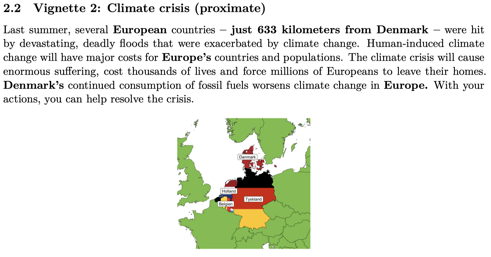
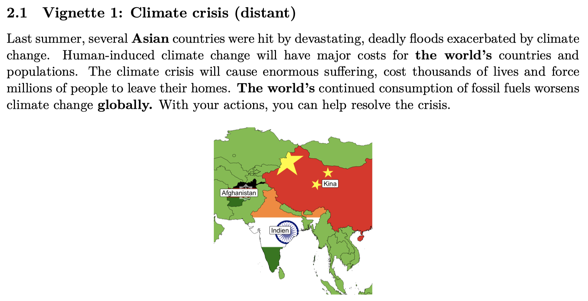
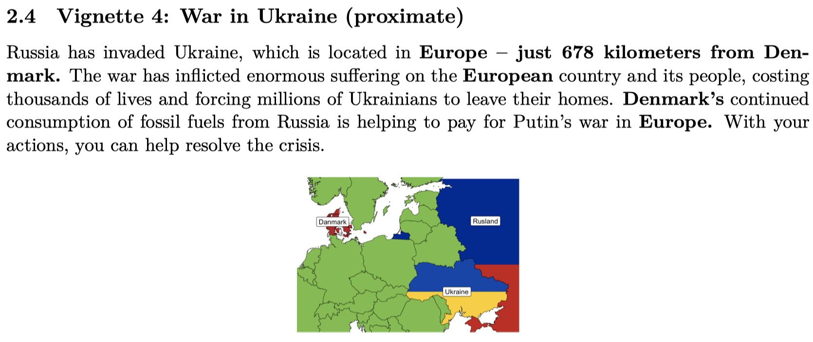
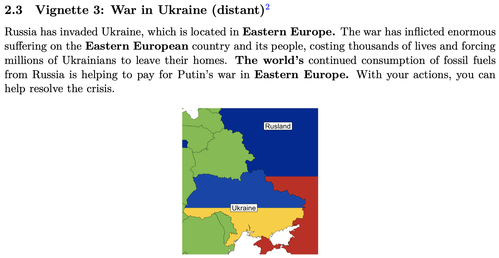
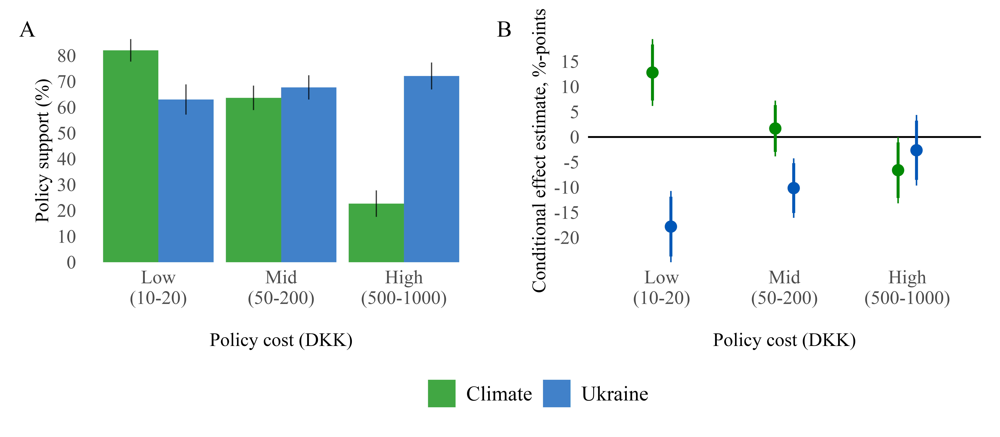

```{r, include = FALSE}
pacman::p_load(tidyverse, 
               knitr, 
               lubridate, 
               kableExtra,
               xaringan,
               xaringanExtra)

knitr::opts_chunk$set(echo = FALSE, 
                      fig.align = "center", 
                      cache = TRUE,
                      out.width="1000px"
)

Sys.setlocale(locale = "da_DK.UTF-8")

xaringanExtra::use_tile_view()
xaringanExtra::use_panelset()
```

```{r xaringan-themer, include=FALSE, warning=FALSE}
library(xaringanthemer)

style_mono_accent(
  # Colors
  base_color = "#8b2325",
  text_color = "#000000", 
  link_color = "#808080", 
  text_bold_color = "#8b2325",
  title_slide_background_color = "#8b2325",
  title_slide_text_color = "#FFFFFF",
  colors = c("white" = "#FFFFFF", "black" = "#000000", "grey" = "#808080", "kingblue" = "#0D0668", "lightgrey" = "#CDCEC6"),
  # Fonts
  text_bold_font_weight = "normal",
  text_font_base = "sans-serif",
  text_font_google = google_font("Metrophobic"),
  code_font_google = google_font("Metrophobic"),
  header_font_google = google_font("Metrophobic"),
  base_font_size = "16pt",
  text_font_size = "16pt",
  code_font_size = "16pt",
  code_inline_font_size = "16pt",
  header_h1_font_size = "30pt",
  header_h2_font_size = "20pt",
  header_h3_font_size = "20pt")

# Ekstra
style_extra_css(
  css = list(
    ".left-column" = list("width" = "33%",
                          "height" = "95%",
                          "float" = "left"),
    ".right-column" = list("width" = "65%",
                           "height" = "95%",
                           #"padding-left" = "1em",
                           "float" = "right")))
```

# Study overview

<br>

- **What happens to climate support when new crises emerge?**

- Focus on **climate crisis** and the **war in Ukraine**

- Co-authored with Jakob Dreyer

--

<br>

## Hypotheses

1. 'Finite pool of worry' &rarr; support decreases for both crises
2. 'Hit two issues with one stone' &rarr; support increases for both crises
3. Independent judgement &rarr; no effects

---

# Data

<br>

- Survey experiment
- Denmark
- Administered by YouGov
- 4,017 participants
- June 24 to July 28, 2022

---

# Treatment vignettes

.panelset[
.panel[.panel-name[Climate crisis v1]<br>

```{r, out.width="85%"}

```

]

.panel[.panel-name[Climate crisis v2]<br>

```{r, out.width="85%"}

```

]

.panel[.panel-name[Ukraine war v1]<br>

```{r, out.width="85%"}

```

]

.panel[.panel-name[Ukraine war v2]<br>

```{r, out.width="85%"}

```

]
]

---

# Outcomes

.panelset[
.panel[.panel-name[Willingness to pay]<br>

<br>

1. **Charity donations** in real lottery with 250 DKK prizes

2. **Policy support:** Denmark still consumes large quantities of [/ Russian] fossil fuels (e.g., gas and oil), which exacerbates the [climate crisis / war in Ukraine]. If parliament proposed a new initiative to [increase the price of CO2 emissions to help Denmark achieve its climate targets / cut imports of fossil fuels from Russia] – and the proposal cost the average Danish citizen [10-1000] DKK per month – **would you support the proposal?**

]

.panel[.panel-name[Crisis perceptions]<br>

<br>

1. **Challenge:** The [climate crisis / war in Ukraine] is the largest societal challenge of our time

2. **Threat:** [Climate change / the war in Ukraine] is a threat to me and my family

3. **Worry:** I do *not* worry that much about the [climate crisis / war in Ukraine]

]

.panel[.panel-name[Willingness to act index]<br>

<br>

**I will cut my energy consumption to help [the climate / us become independent of Russian energy] by:**

1. Using public transportation more
2. Flying less
3. Putting on more clothes instead of turning up the heat when it is cold
4. Saving electricity
5. Eating more locally produced food
6. Buying more second-hand instead of new products

]
]

---

.pull-left[

# Research design based on the sequence of treatment vignettes and questions

]

.pull-right[

```{r, out.width="90%"}
include_graphics("media/figure1_new.png")
```

]

---

# Results for climate change

*What happens when the Ukraine war is primed together with the climate crisis?*

---

# Results for climate change

```{r, out.width="80%"}
include_graphics("media/figure2.png")
```

---

# Results for climate change

.pull-left[
```{r, out.width="100%"}
include_graphics("media/figure2.png")
```
]

.pull-right[

<br>

- Overall **climate support** tends to *increase*<br>(somewhat surprising)
- Notably **Threat**, **Worry**, and **Policy support**
- Nothing for **willingness to act**
- **Ukraine support** tends towards opposite pattern

]

---

# Results for climate change &mdash; pocketbook costs

*What happens to climate support as the private costs increase?*

---

# Results for climate change &mdash; pocketbook costs

<br>

```{r, out.width="80%"}

```

--

- Public climate support is *not* high at **high costs**
- Ukraine war *only* increases climate support at **low costs**
- Tempering and somewhat puzzling

---

# Conclusion

<br>

1. **No evidence that war crowds out public support** or worry about climate change

2. Rather, the contrary &mdash; **war increases climate support** &mdash; perhaps because of direct comparison

3. However, hard limit to increased climate support in **private pocketbooks costs**

---
class: title-slide, middle, center

# Thank you!

