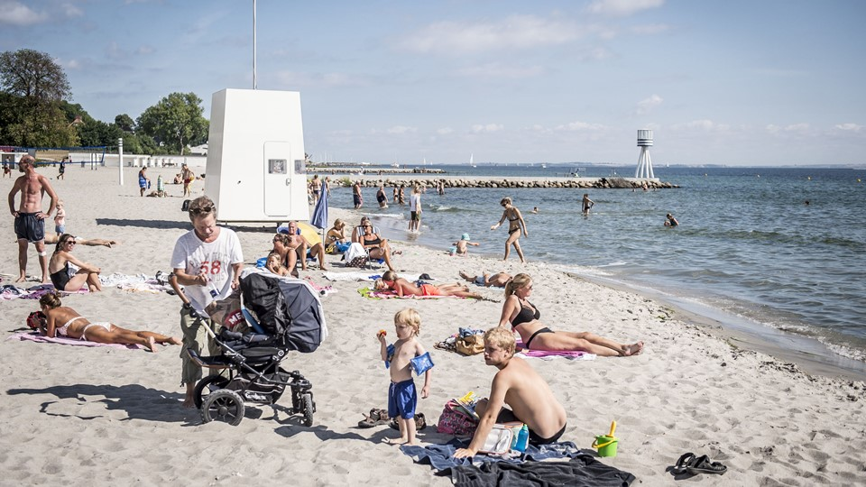
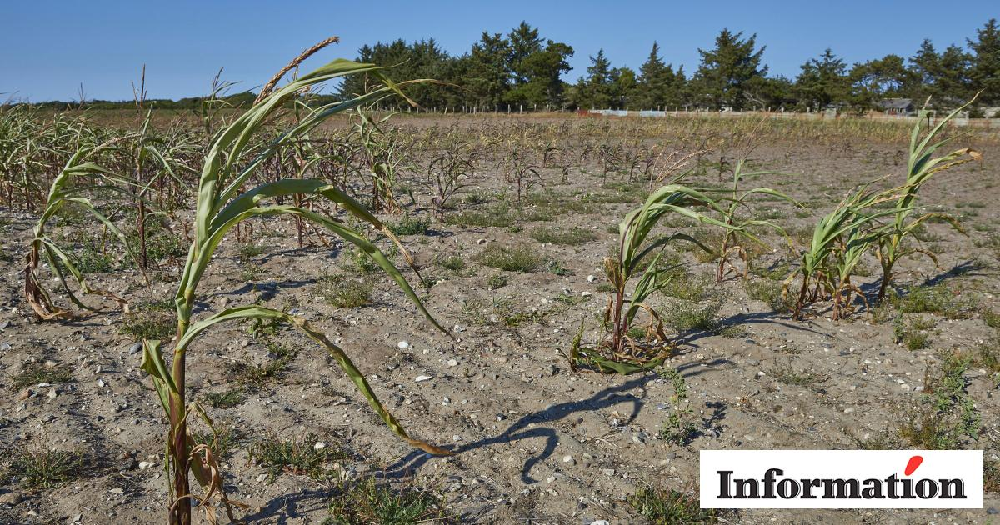
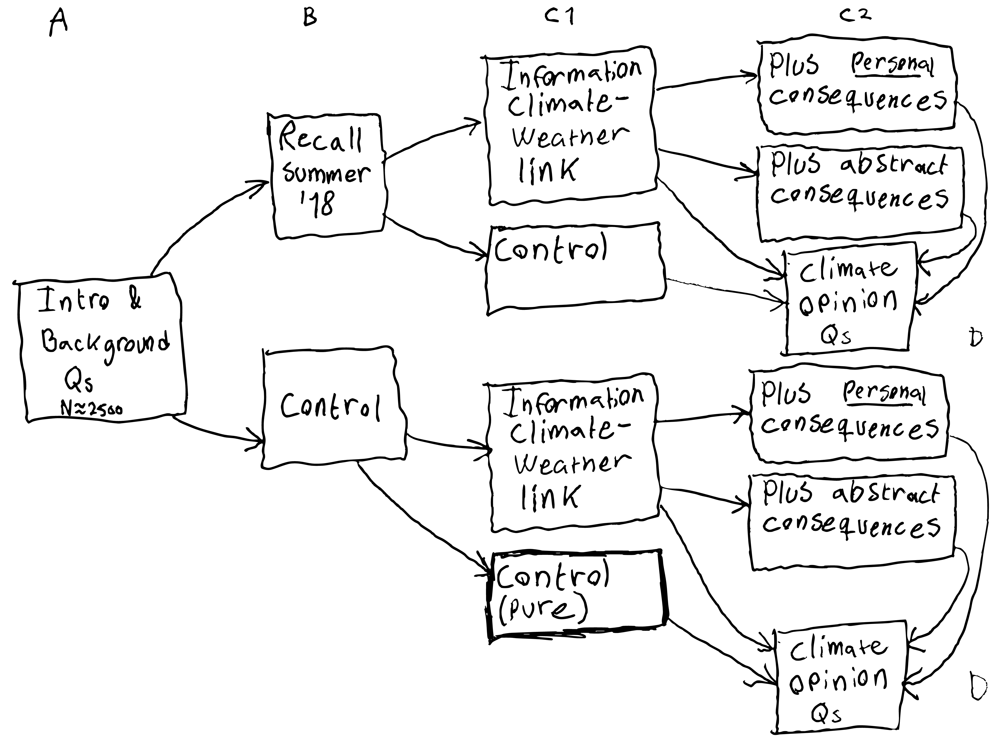

```{r, include = FALSE}

pacman::p_load(tidyverse, 
               knitr, 
               lubridate, 
               kableExtra,
               xaringan,
               xaringanExtra)

knitr::opts_chunk$set(echo = FALSE, 
                      fig.align = "center", 
                      cache = TRUE,
                      out.width="1000px"
                      )

Sys.setlocale(locale = "da_DK.UTF-8")

xaringanExtra::use_tile_view()

```

# Background

<br>

- **Survey** on climate change opinion formation

- To be conducted in DK in January 2022 by Epinion

- Split-sample experimental design

- Around 30 questions in total

---

# Theory and contribution

<br>

- Several ways to come across information about climate change, notably:

  - Personal (weather) experience 
  - Media coverage (communication)

- We expect both to potentially strengthen climate opinions

- But how do they interact? Are personal experiences activated/politicized by mediated accounts of how local weather extremes relate to climate change? When does climate science communication "work"?

> __Preliminary RQ: How does information about the scientific link between global climate change and extreme local weather events moderate the influence of personal experience with such events on climate opinions?__  

- Contributes to (a) climate change communication and (b) opinion formation

---

# Case and treatments

.pull-left[
- **Case**: Unprecedented Danish summer weather in 2018 with **heat**waves, drought, and excessive sunshine
- Everybody has (varying) experiences with **heat** and connection to climate change is clear

## Treatments

1. **Facts about the 2018 summer** to aid recall<br>[no mention of climate change]
2. **Information about the link** between extreme weather and climate change
3. (Additional) information about potential **consequences** for (a) respondent personally or (b) other people
4. Objective **recent temperatures** where the respondent lives [not manipulated]
]

.pull-right[
```{r beach}

```
```{r drought}

```
]

---

# Core hypotheses

*Personal weather experience*

- **H1:** Recalling the extreme **summer weather** in 2018 increases "climate awareness"

- **H2:** Recent exposure to warmer-than-usual **temperatures** increases "climate awareness"

--

*Personal weather experience plus information*

- **H3:** **Information** on the scientific link between extreme weather and climate change increases "climate awareness"

- **H4:** The recall effect (H1) and temperature effect (H2) are strengthened by climate-weather **information**

--

*Priming self-interest*

- **H5:** The direct effect of **information** (H3) and the moderation effect of information (H4) are both stronger when the information treatment primes **self-interest**

---

# Survey design sketch

```{r design, out.width="750px"}

```

---

# Treatment 1 - Facts about the 2018 summer

.pull-left[
"Now we will ask you to think back to the Danish summer of 2018 almost four years ago. Do you remember what the weather was like? Here are some highlights:

- Record-breaking heat
- Numerous heatwaves
- Most sunny summer ever recorded
- The worst drought in a century 
- Nation-wide open burning ban

How well do you remember the summer weather of 2018?"
]
---

# Treatment 2 - Information on link to climate change

.pull-left[
"Research shows that human activity is changing the climate. This creates a new normal for the Danish weather with higher risk of heatwaves, drought, cloudbursts, and storm surges.

- Emissions of greenhouse gasses increase Earth's temperature
- New research shows that the average temperature in Denmark has already increased by 2.3 degrees and is headed towards 4.2 degrees in 2100
- Consequently, extreme heat becomes more intense, frequent, and long-lasting
- Any summer can still be cold or hot, but the most extreme and dangerous hot summers have become 50 times more likely"
]

---

# Treatment 3 - Information on consequences

.pull-left[
"Higher temperatures in the future can have negative consequences for <**you and your family**>/<**people in Denmark**> as extreme heat can damage food systems, nature, and infrastructure, and can have negative health impacts such as headaches, faintness, etc. etc."
]
---

# Treatment 4 - Recent temperatures

.pull-left[
- Objectively measured average temperature

- Measured where the respondent lives 

- 7 days before survey response

- Relative to normal temperature for that time and place  
]

---

# Outcomes

<br>

Three dimensions: 

1. "**Climate awareness**" (perceptions of global climate change, human causes, problem status, risk perceptions, etc.)

2. **Climate worry** (e.g., for oneself/family, country, ecosystems, world's vulnerable people)

3. **Policy support**, intended **behavioral change**, and **willingness-to-pay**

---

# Survey design sketch again

```{r design2, out.width="750px"}

```